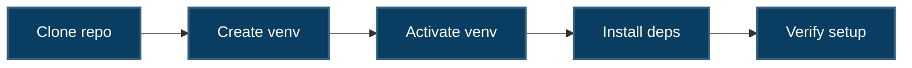

# Contributing to Velune CLI

*Development setup, how to add providers/commands/agents, and the review
process.*

> **Important:** For anything larger than a small fix, open an issue first
> to discuss scope before writing code.

---

## Contents

- [Development setup](#development-setup)
- [Running tests and linting](#running-tests-and-linting)
- [How to add a new cloud provider](#how-to-add-a-new-cloud-provider)
- [How to add a new top-level CLI command](#how-to-add-a-new-top-level-cli-command)
- [How to add a new slash command](#how-to-add-a-new-slash-command)
- [How to add a new council agent or critic](#how-to-add-a-new-council-agent-or-critic)
- [Pull request checklist](#pull-request-checklist)
- [Commit message format](#commit-message-format)
- [Code style](#code-style)
- [Reporting bugs](#reporting-bugs)
- [Review expectations](#review-expectations)
- [Code of conduct](#code-of-conduct)

---

## Development setup



```bash
git clone https://github.com/Surya-Hariharan/Velune-CLI.git
cd Velune-CLI

python -m venv .venv
source .venv/bin/activate          # macOS / Linux
.venv\Scripts\activate             # Windows

pip install -e ".[dev]"
```

`[dev]` installs `ruff`, `pyright`, `pre-commit`, `pip-audit`,
`bandit[toml]`, `build`, `twine`, `pytest`, and `pytest-asyncio` — everything
CI runs, minus the OS-level Go/Rust toolchains (only needed if you're
touching `ext/go` or `ext/rust`).

`uv.lock` pins the exact resolved dependency graph (versions + hashes) on top
of `pyproject.toml`'s version floors, so a dev machine, CI, and a release
build all resolve identically instead of drifting on "whatever's newest
today". CI's `Verify lockfile reproducibility` step (`uv lock --check`) fails
the build if the two have gone out of sync. If you change a dependency in
`pyproject.toml`, regenerate the lock in the same commit:

```bash
pip install uv   # or: pipx install uv
uv lock
```

Optionally, install the pre-commit hooks so lint/format run automatically on
`git commit` (ruff --fix, ruff-format, trailing-whitespace, end-of-file-fixer,
check-yaml, check-added-large-files, check-merge-conflict, detect-private-key,
then pyright):

```bash
pre-commit install
```

Also install the pre-push hook stage to run a local secret scan
(`.githooks/pre-push-secret-scan.sh`) before anything leaves your machine —
`pre-commit install` alone only wires the commit-time hooks above; push-time
hooks are a separate install:

```bash
pre-commit install --hook-type pre-push
```

This needs [gitleaks](https://github.com/gitleaks/gitleaks#installing) on
your `PATH`; without it, the hook prints a warning and skips itself rather
than blocking your push — CI's own gitleaks step (`.github/workflows/ci.yml`)
is the real, always-on gate either way, this is just an earlier local catch.

Verify the install:

```bash
velune --version
velune doctor
```

---

## Running tests and linting

```bash
# Fast unit tests
pytest tests/unit -q

# Full suite
pytest tests/ -v

# Lint (must pass before merging)
ruff check velune/
ruff format --check velune/

# Type check (blocking — CI runs pyright, not mypy)
pyright velune/

# Coverage
pytest tests/ --cov=velune --cov-report=term-missing -q
```

All of `ruff check`, `ruff format --check`, `pyright`, and `pytest` must
pass before a PR will be merged — see the `lint` and `test` jobs in
[docs/DEVELOPMENT.md § CI pipeline](docs/DEVELOPMENT.md#4-ci-pipeline) for
exactly what CI runs.

---

## How to add a new cloud provider

This example adds a fictional **Nebula** provider. Follow the same pattern
for any new cloud API — Velune CLI ships 17 real provider adapters under
`velune/providers/adapters/` you can use as references (`together.py` and
`fireworks.py` are good OpenAI-compatible examples; `anthropic.py` and
`google.py` are good from-scratch examples).

### Step 1 — Create the adapter

`velune/providers/adapters/nebula.py`

Implement the `ModelProvider` protocol
(`infer()`, `stream()`, `list_models()`, `health_check()` —
`velune/providers/base.py`). If the API is OpenAI-compatible, inherit from
`OpenAIProvider` and override only `provider_id` and the base URL:

```python
from velune.providers.adapters.openai import OpenAIProvider

class NebulaProvider(OpenAIProvider):
    provider_id = "nebula"

    def __init__(self, api_key: str | None = None) -> None:
        super().__init__(
            api_key=api_key,
            base_url="https://api.nebula.ai/compatibility/v1",
        )
```

If the API is not OpenAI-compatible, inherit from `ModelProvider` directly
(see `anthropic.py` for a from-scratch reference implementation).

### Step 2 — Create the discovery module

`velune/providers/discovery/nebula.py`

The discovery module returns a hardcoded list of `ModelDescriptor` objects
so the model registry can surface them without a live API call. `discover()`
is `async`, and the key check goes through the `keystore` module (not a
from-imported name) so it stays live and patchable in tests:

```python
from velune.core.types.model import CapabilityLevel, ModelDescriptor
from velune.providers import keystore

NEBULA_MODELS: list[ModelDescriptor] = [
    ModelDescriptor(
        model_id="nebula-large",
        provider_id="nebula",
        display_name="Nebula Large",
        context_length=128000,
        capabilities={
            "coding": CapabilityLevel.ADVANCED,
            "reasoning": CapabilityLevel.ADVANCED,
        },
        is_local=False,
        speed_tier="medium",
        cost_per_1k_tokens=0.003,
    ),
]


class NebulaDiscovery:
    provider_id = "nebula"

    async def discover(self) -> list[ModelDescriptor]:
        if not keystore.has_key("nebula"):
            return []
        return NEBULA_MODELS
```

### Step 3 — Register in the provider registry

`velune/providers/registry.py` → `_register_default_providers()`

```python
self.register_factory(
    "nebula",
    self._keyed_factory(
        "velune.providers.adapters.nebula", "NebulaProvider", "nebula"
    ),
)
```

### Step 4 — Add display metadata

`velune/providers/catalog.py` → `_PROVIDERS` tuple

This is the single source of truth for provider display metadata (name,
description, free tier, key URL) — it replaced three independently
hand-maintained copies of the same list, so this is the only file to touch
for display metadata:

```python
ProviderMeta(
    id="nebula",
    display_name="Nebula",
    description="Fictional example cloud provider for this walkthrough.",
    requires_key=True,
    free_tier=False,
    key_label="Nebula API key",
    get_key_url="https://dashboard.nebula.ai/api-keys",
    env_var=PROVIDER_ENV_VARS.get("nebula"),
),
```

### Step 5 — Add the environment variable fallback

`velune/providers/keystore.py` → `PROVIDER_ENV_VARS` dict

```python
PROVIDER_ENV_VARS: dict[str, str] = {
    ...
    "nebula": "NEBULA_API_KEY",
}
```

### Step 6 — Add cost data

`velune/telemetry/token_tracker.py` → `PROVIDER_COSTS` dict

```python
PROVIDER_COSTS: dict[str, dict[str, float]] = {
    ...
    "nebula": {
        "nebula-large": 0.003,
        "nebula-small": 0.0005,
    },
}
```

### Step 7 — Write tests

There's no single canonical `test_providers.py` — provider tests are split
across `tests/test_provider_manager.py`, `tests/test_provider_default.py`,
and `tests/test_providers_extended.py`. Add discovery/cost-table tests to
whichever most closely matches what you're testing, e.g.:

```python
async def test_nebula_discovery_skips_without_key(monkeypatch):
    monkeypatch.setenv("NEBULA_API_KEY", "")
    from velune.providers.discovery.nebula import NebulaDiscovery
    assert await NebulaDiscovery().discover() == []

async def test_nebula_discovery_returns_models(monkeypatch):
    monkeypatch.setenv("NEBULA_API_KEY", "test-key")
    from velune.providers.discovery.nebula import NebulaDiscovery
    models = await NebulaDiscovery().discover()
    assert any(m.model_id == "nebula-large" for m in models)

def test_nebula_cost_table_entry():
    from velune.telemetry.token_tracker import PROVIDER_COSTS
    assert "nebula" in PROVIDER_COSTS
```

### Step 8 — Update the README

Add `Nebula` to the Providers table in [README.md](README.md).

---

## How to add a new top-level CLI command

Top-level `velune <command>` entries (as opposed to REPL `/slash` commands,
covered next) are a **declarative spec table**, not eager Typer
registration — this keeps `velune --version` and `velune --help` from
importing every command module's dependency tree on every invocation.

### Step 1 — Add a `CommandSpec`

`velune/cli/registry.py` → `COMMAND_SPECS` tuple

```python
CommandSpec(
    "yourcommand",
    "command",                              # or "typer" for a sub-app group
    "velune.cli.commands.yourcommand",      # module — imported lazily
    "yourcommand_command",                  # attribute to import from it
    _CORE,                                  # panel/group shown in --help
    "One-line description of what it does.",
    bootstrap="full",                       # "light" for read-only/diagnostic commands
),
```

Set `bootstrap="light"` only if the command doesn't touch memory,
retrieval, cognition, or orchestration — that skips the expensive Tier-1
subsystem bootstrap entirely and saves roughly 2 seconds of startup. See
[docs/DEVELOPMENT.md § The bootstrap / DI layer](docs/DEVELOPMENT.md#1-the-bootstrap--di-layer).

### Step 2 — Implement the command function

`velune/cli/commands/yourcommand.py`

The module and function are only imported when this specific command is
invoked, so nothing else needs to change for lazy-import correctness — just
write a normal Typer command function matching the `attr` name from the spec.

### Step 3 — Write a test

`tests/test_cli.py` builds the app with `create_app(register="__all__")` and
drives it with Typer's `CliRunner` — follow the existing `test_doctor_help`-
style tests there to invoke `--help` on your new command and assert it
appears, then add focused tests for its actual logic:

```python
def test_yourcommand_help(app):
    result = runner.invoke(app, ["yourcommand", "--help"])
    assert result.exit_code == 0
```

---

## How to add a new slash command

REPL `/slash` commands are registered by a **factory function**, not a
method on the REPL class — this keeps the 4,000+-line `repl.py` focused on
execution logic rather than command-table bookkeeping.

### Step 1 — Register in the slash registry

`velune/cli/slash_dispatcher.py` → `build_slash_registry()`

```python
registry.register(
    SlashCommand(
        name="yourcommand",
        aliases=["yc"],
        description="One-line description of what it does",
        usage="/yourcommand [optional-arg]",
        handler=repl._cmd_yourcommand,
        examples=("/yourcommand", "/yourcommand foo"),
        search_terms=("keyword", "another-keyword"),
    )
)
```

Then add `"yourcommand": "YourCategory"` to the `_BUILTIN_CATEGORIES` dict
at the top of the same file — this is the single source of truth for
`/help` grouping and completion-menu grouping, and a test asserts every
registered built-in has an entry (no silent fallback to "General").

### Step 2 — Implement the handler

Add the async method to `VeluneREPL` (anywhere in the "Command handlers"
section of the class):

```python
async def _cmd_yourcommand(self, args: str) -> None:
    # args is everything after "/yourcommand " — may be empty
    self.console.print(f"[cyan]You typed:[/cyan] {args!r}")
```

Handlers must be `async`. Use `self.console.print()` for all output
(never `print()`). Access the container for services:

```python
model_registry = self.container.get("runtime.model_registry")
```

### Step 3 — Write a test

There's no single `test_repl.py` — REPL handler tests live in files like
`tests/test_repl_prompt_turn.py`. Construct the REPL with
`VeluneREPL.__new__(VeluneREPL)` (bypassing the heavyweight `__init__`) and
set only the attributes your handler touches:

```python
from unittest.mock import MagicMock
from velune.cli.repl import VeluneREPL

def _make_repl() -> VeluneREPL:
    repl = VeluneREPL.__new__(VeluneREPL)
    repl.container = MagicMock()
    repl.console = MagicMock()
    return repl

async def test_cmd_yourcommand():
    repl = _make_repl()
    await repl._cmd_yourcommand("some-arg")
    repl.console.print.assert_called()
```

> **Debugging note:** if your handler doesn't seem to fire, check that it's
> actually registered in `build_slash_registry()` — an implemented-but-
> unregistered `_cmd_*` method fails silently (it just never appears in
> `/help` or dispatch), it doesn't raise at import time.

---

## How to add a new council agent or critic

The core council pipeline (`velune/cognition/council_runner.py`) is a
**fixed six-phase sequence** — Planner → Coder → Reviewer loop → Challenger
→ Debate → Synthesizer — not a per-tier configurable list. Adding a wholly
new pipeline phase is a structural change to that runner, not a drop-in
extension point.

The actual extension point is **critics** — specialized reviewers
(currently Scalability, Security, Performance, Maintainability) that are
config-driven and independently tier-gated in
`velune/cognition/orchestrator.py`. Follow this pattern for a new critic:

### Step 1 — Define the critic's config

`velune/cognition/council/critic_configs.py`

```python
from velune.cognition.council.critic_configs import CriticConfig
from velune.models.specializations import CouncilRole

ACCESSIBILITY_CONFIG = CriticConfig(
    name="Accessibility",
    council_role=CouncilRole.REVIEWER,
    system_prompt="""You are the Accessibility Critic for the Velune CLI Reasoning Council.
Your role is to critique UI-facing changes for a11y regressions.

OUTPUT EXCLUSIVELY A RAW VALID JSON OBJECT WITH NO CODEBLOCK WRAPPERS OR Markdown.
JSON Format:
{
  "passed": true/false,
  "issues": ["Issue description 1"],
  "score": 0.0 to 1.0,
  "rationale": "..."
}
""",
    output_fields={"passed": True, "issues": [], "score": 0.9, "rationale": ""},
)
```

### Step 2 — Create the critic class

`velune/cognition/council/critics.py`

```python
class AccessibilityCritic(CriticAgent):
    def __init__(self, model: ModelDescriptor, provider: ModelProvider) -> None:
        super().__init__(ACCESSIBILITY_CONFIG, model, provider)
```

> `CriticAgent` itself is fully config-driven (its docstring literally says
> "replace all specific critic classes with this") — a dedicated subclass
> is only for symmetry with the existing four. You can skip this step and
> instantiate `CriticAgent(ACCESSIBILITY_CONFIG, model, provider)` directly
> in the factory method below if you'd rather not add a one-line class.

### Step 3 — Register a factory method

`velune/cognition/council/factory.py` → `CouncilAgentFactory`

Add a `create_accessibility_critic(self, run_id: str)` method following the
shape of the existing `create_scalability_critic` / `create_security_critic`
/ `create_performance_critic` / `create_maintainability_critic` methods.

### Step 4 — Wire tier gating

`velune/cognition/orchestrator.py`, near the other `agent_factory.create_*`
calls — gate instantiation on `tier_level` the same way the existing critics
are (e.g. `tier_level >= 2` for lightweight critics, `tier_level >= 3` for
more expensive ones):

```python
accessibility_critic = (
    self.agent_factory.create_accessibility_critic(run_id) if tier_level >= 2 else None
)
```

### Step 5 — Write tests

There's no dedicated `test_council.py` yet — `tests/test_council_view.py`
is the closest existing file (it currently only covers the display layer,
not agent logic), so either extend it or start a new
`tests/test_council_agents.py`. A critic's public entry point is
`critique(task, proposal, context)`, returning a `CriticMessage`:

```python
async def test_accessibility_critic_flags_issues(mock_provider):
    from velune.cognition.council.critics import AccessibilityCritic
    critic = AccessibilityCritic(model=mock_model, provider=mock_provider)
    result = await critic.critique(task="...", proposal="...", context="...")
    assert result.parse_error is None
```

---

## Pull request checklist

Before requesting review:

- [ ] All existing tests pass: `pytest tests/ -q`
- [ ] New code has tests — unit tests for pure logic, integration
      tests for provider/agent/slash-command wiring
- [ ] `ruff check velune/` and `ruff format --check velune/` show zero issues
- [ ] `pyright velune/` shows zero new errors
- [ ] `velune doctor` passes on a clean install (check CI)
- [ ] [CHANGELOG.md](CHANGELOG.md) has an entry under `[Unreleased]`
- [ ] README updated if a user-facing feature was added
- [ ] No secrets, `.env` files, or API keys committed
- [ ] Branch targets `main` and is rebased to latest `main`

---

## Commit message format

Use [Conventional Commits](https://www.conventionalcommits.org/):

```text
feat: add Nebula provider adapter
fix: handle Ollama connection timeout gracefully
docs: update MCP integration guide
test: add tests for token tracker edge cases
refactor: extract model selector into separate module
chore: bump httpx to 0.27
```

Subject line: imperative tense, ≤ 72 characters, no trailing period.

For breaking changes add `!` after the type: `feat!: rename /run to /exec`

---

## Code style

- **Python 3.10+** — use `X | Y` not `Optional[X]`, `list[str]` not
  `List[str]` (`requires-python = ">=3.10"`; CI's `test` job runs the full
  matrix down to 3.10, so don't rely on 3.11+-only syntax)
- **async/await throughout** — no blocking I/O inside `async` functions;
  use `asyncio.to_thread()` for CPU-bound work if needed
- **All user-facing output** goes through `self.console.print()` (Rich);
  never `print()`
- **No `shell=True`** in subprocess calls — always pass a list of args
  (CI's `security` job fails the build if it finds one)
- **API keys** always via `velune.providers.keystore.get_key()` / `has_key()`
  — never `os.getenv()` directly in provider code
- **File writes** inside the workspace go through the diff preview
  system — never `path.write_text()` directly in council agents
- **No comments** explaining what the code does — use clear names.
  Comment only when explaining a non-obvious invariant or workaround.

---

## Reporting bugs

Open a GitHub issue with:

```text
velune --version
velune doctor
```

Include the exact command that failed, the full error message (run with
`--verbose` for stack traces), and your OS and Python version.

> **Caution:** Do not report security vulnerabilities in public issues.
> Report them via
> [GitHub Security Advisories](https://github.com/Surya-Hariharan/Velune-CLI/security/advisories/new).

---

## Review expectations

- Keep changes focused — one concern per PR.
- Explain the *why* in the PR description; the code explains the *what*.
- Address review comments within a few days; stale PRs may be closed.
- Reviewers run `pytest` locally before approving non-trivial changes.

---

## Code of conduct

This project follows the [Contributor Covenant](CODE_OF_CONDUCT.md).
Violations may be reported to the maintainer.

---

Apache License 2.0 — Copyright 2026 Surya HA
