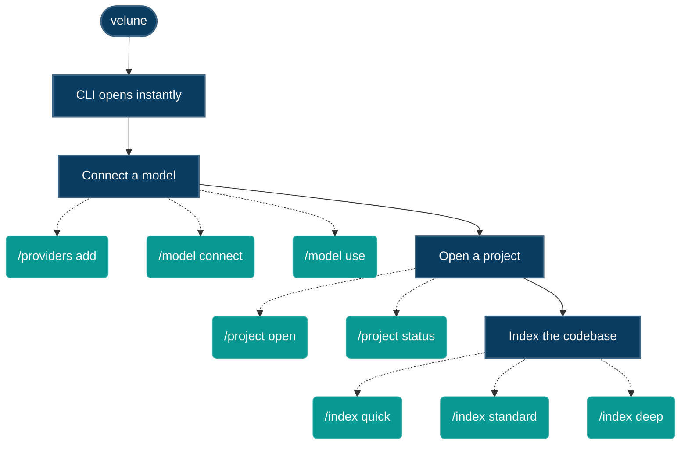

<div align="center">

# Velune CLI

**Local-first multi-model AI developer CLI.**
Council-based agents. Persistent memory. Repository cognition.

No cloud required. No quota. No lock-in.

[](https://pypi.org/project/velune-cli/)
[](https://python.org)
[](LICENSE)
[](https://github.com/Surya-Hariharan/Velune-CLI/actions/workflows/ci.yml)

[Quickstart](#60-second-quickstart) · [Commands](#commands) · [Architecture](#architecture) · [Docs](#project-docs) · [Contributing](#contributing)

</div>

---

## Contents

- [What it does](#what-it-does)
- [60-second quickstart](#60-second-quickstart)
- [Hardware requirements](#hardware-requirements)
- [Startup flow](#startup-flow)
- [Interface](#interface)
- [Providers](#providers)
- [Commands](#commands)
- [Architecture](#architecture)
- [Memory system](#memory-system)
- [Session modes](#session-modes)
- [MCP integration](#mcp-integration)
- [Windows](#windows)
- [Project docs](#project-docs)
- [Optional extras](#optional-extras)
- [Contributing](#contributing)
- [License](#license)

---

## What it does

Velune CLI is a terminal-first AI coding assistant that runs a council of
specialized agents (Planner, Coder, Reviewer, Challenger, Synthesizer) on
your local machine using Ollama, or on free cloud tiers via Groq,
OpenRouter, and others.

|  | Velune CLI | Copilot / Cursor |
| :--- | :--- | :--- |
| **Runs fully offline** | ✅ Yes, via Ollama — no API key | ❌ Always cloud-dependent |
| **Remembers your codebase** | ✅ 5-tier persistent memory across sessions | ⚠️ Per-session context only |
| **Reviews its own output** | ✅ Multi-agent council debates before you see a diff | ❌ Single model, single pass |
| **Editor required** | ✅ None — any terminal, any project | ❌ IDE extension |
| **Your code leaves the machine** | ✅ Never, in local mode | ⚠️ Depends on provider |

---

## 60-second quickstart

### Option A — Local (Ollama, free, no key)

```bash
# 1. Install Ollama
curl -fsSL https://ollama.com/install.sh | sh

# 2. Pull a model
ollama pull qwen2.5-coder:7b

# 3. Install Velune CLI
pip install velune-cli

# 4. Initialize in your project
cd your-project
velune init

# 5. Start
velune
```

### Option B — Cloud free tier (Groq, fastest, no GPU needed)

```bash
pip install velune-cli
velune init --provider groq
velune setup        # enter your free Groq key
velune
```

Get a free Groq key at <https://console.groq.com/keys> — no credit card.

<details>
<summary><strong>Installing the <code>velune</code> command</strong> — click if <code>command not found</code></summary>

```bash
pip install velune-cli
velune --version
```

The Python package is the authoritative runtime. Optional Go and Rust native
components live under `ext/` and are validated in CI; Velune CLI keeps
pure-Python fallbacks for the Rust-backed repository helpers, so the
standard PyPI install works without compiling native code.

If your shell reports **`velune: command not found`** (or, on Windows,
*"'velune' is not recognized…"*), the install succeeded but your Python
scripts directory is not on `PATH`. Two reliable fixes:

- **Recommended — install with [pipx](https://pipx.pypa.io/)** (isolated env, auto-managed PATH):

  ```bash
  pipx install velune-cli
  ```

- **Or run it as a module** (always works, no PATH changes needed):

  ```bash
  python -m velune --version
  python -m velune            # start the REPL
  ```

On Windows, a plain `pip install` puts the launcher in a per-user
`…\PythonXX\Scripts` folder; re-running the Python installer with **"Add
Python to PATH"** checked (or using `pipx`) resolves it permanently.

</details>

---

## Hardware requirements

| RAM | Accelerator | Local LLM? | Recommended setup |
| :---: | :--- | :--- | :--- |
| **< 8 GB** | Any | ❌ No | Use Groq free tier |
| **8 GB** | Integrated | ⚠️ 3B models only | Groq + `phi3-mini` local |
| **16 GB** | Integrated (no dGPU) | ⚠️ Slow, 3B only | Groq + 3B local |
| **16 GB** | 6+ GB VRAM | ✅ 7B comfortable | `qwen2.5-coder:7b` |
| **16 GB** | Apple Silicon | ✅ 13B comfortable | Full council, Metal accel |
| **32 GB** | 12+ GB VRAM | ✅ 13B comfortable | Full council local |
| **36 GB+** | Apple Silicon | ✅ 70B comfortable | Max power, Metal accel |
| **64 GB** | 24+ GB VRAM | ✅ 70B capable | Max power mode |

> Velune CLI detects your hardware on startup and prints tier, GPU, and
> recommendations. On underpowered machines, it routes tasks to cloud
> providers automatically.

---

## Startup flow

Velune CLI starts instantly and does no work until you ask for it. Repository
cognition (indexing) is **explicit and on-demand** — it never runs
automatically on launch.



---

## Interface

- **Startup banner** shows your hardware tier, active model, and available providers
- **Responsive prompt** with intelligent context indicators (only displays when relevant)
- **Restrained, single-accent color palette** — clarity over decoration
- **Tab-completion** for every `/` command and for model IDs
- **Session modes** for balancing speed vs. quality (`/optimus` · `/normal` · `/godly`)
- **Live dashboard** (`/dashboard`) — background jobs, proactive alerts, provider health in one view

The status bar shows `⚙ N bg` for active background jobs and `⚠ N` for
unread proactive alerts. Alerts drain automatically after each prompt and
render as panels above the input line.

---

## Providers

| Provider | Type | Cost | Models | Setup |
| :--- | :---: | :--- | :--- | :--- |
| **Ollama** | 🏠 Local | Free | Any pulled model | Install Ollama, pull a model |
| **LM Studio** | 🏠 Local | Free | Any GGUF / MLX model | Launch LM Studio server |
| **OpenAI-compatible** | 🏠 Local | Free | vLLM, LocalAI, text-generation-webui, … | Point at your server's base URL |
| **Groq** | ☁️ Cloud | Free tier | Llama 3.3 70B, Mixtral, Gemma2 | `/providers add groq` |
| **OpenRouter** | ☁️ Cloud | Pay-per-token | 100+ models | `/providers add openrouter` |
| **OpenAI** | ☁️ Cloud | Pay-per-token | GPT-4o, GPT-4o Mini | `/providers add openai` |
| **Anthropic** | ☁️ Cloud | Pay-per-token | Claude Opus, Sonnet, Haiku | `/providers add anthropic` |
| **xAI (Grok)** | ☁️ Cloud | Pay-per-token | Grok 2, Grok 2 Mini | `/providers add xai` |
| **Google** | ☁️ Cloud | Free quota | Gemini 2.0 Flash, 1.5 Pro/Flash | `/providers add google` |
| **Together AI** | ☁️ Cloud | Pay-per-token | Llama 3.3 70B, Qwen 2.5, DeepSeek R1 | `/providers add together` |
| **Fireworks AI** | ☁️ Cloud | Pay-per-token | DeepSeek R1, Qwen 2.5, Mixtral 8x22B | `/providers add fireworks` |
| **Mistral** | ☁️ Cloud | Pay-per-token | Mistral Large, Codestral, Mixtral | `/providers add mistral` |
| **DeepSeek** | ☁️ Cloud | Pay-per-token | DeepSeek R1, DeepSeek Coder | `/providers add deepseek` |
| **Cohere** | ☁️ Cloud | Pay-per-token | Command R+, Command R | `/providers add cohere` |
| **NVIDIA NIM** | ☁️ Cloud | Pay-per-token | Llama, Mistral, and other NIM models | `/providers add nvidia` |
| **HuggingFace** | ☁️ Cloud | Free/paid | Open models via Inference API | `/providers add huggingface` |

> Keys are stored in your OS keyring, encrypted at rest — never in plain
> text files, never in git. `velune setup` and the REPL's `/providers` /
> `/login` walk you through it either way.

---

## Commands

### CLI (terminal, before the REPL)

Every top-level command below is grouped exactly as `velune --help` groups
it. Most groups take subcommands — run `velune <command> --help` for the
full signature.

<details open>
<summary><strong>Core</strong></summary>

```bash
velune                    # Start the interactive REPL session
velune chat                # Same as above (explicit form)
velune run "<task>"        # Run a task non-interactively and exit
velune ask "<question>"    # Ask a one-shot question and exit
velune init                 # Set up Velune CLI in the current project
velune onboard              # Run (or resume) the first-time setup wizard
```

</details>

<details>
<summary><strong>Workspace &amp; Sessions</strong></summary>

```bash
velune project init|status|graph|tree|list|open|resume|explain
velune session list|resume|show|delete|archive|unarchive|export
```

</details>

<details>
<summary><strong>Setup &amp; Models</strong></summary>

```bash
velune setup                          # Configure providers and models interactively
velune models scan|list|pull|delete|assign|use|benchmark|health|show
velune provider list|add|remove|test|status|edit|inspect|default|backup|restore
velune config show|set|get
velune trust add|list|forget
```

</details>

<details>
<summary><strong>Analytics &amp; Monitoring</strong></summary>

```bash
velune usage      # Token usage and estimated cost for recent sessions
velune quota      # Provider rate-limit and quota status
velune health     # Provider reachability and response time
```

</details>

<details>
<summary><strong>Diagnostics</strong></summary>

```bash
velune doctor check|providers|network
velune logs [recent|live]
velune status                         # Index freshness + workspace health
velune pipeline trace "<query>"       # Trace a query through the retrieval pipeline
velune daemon start|stop|status
velune mcp serve|connect <url> <name>
velune memory stats|inspect|clear|compact
```

</details>

<details>
<summary><strong>Trust &amp; Recovery</strong></summary>

```bash
velune backup [--output <path>] [--with-secrets]   # Snapshot all Velune CLI state to one archive
velune restore <archive> [--overwrite] [--dry-run] # Restore state from a backup archive
velune recover [id] [--all] [--discard <id>]       # Recover an unsaved session after a crash
```

</details>

### Inside the REPL

49 slash commands across 11 categories. The essentials:

<table>
<tr><th>Category</th><th>Commands</th></tr>
<tr><td><strong>Session</strong></td><td><code>/help</code> · <code>/exit</code> · <code>/clear</code> · <code>/new</code></td></tr>
<tr><td><strong>AI</strong></td><td><code>/run &lt;task&gt;</code> · <code>/council &lt;task&gt;</code> · <code>/jobs</code> · <code>/dashboard</code> · <code>/optimus</code> · <code>/godly</code> · <code>/normal</code> · <code>/mode</code></td></tr>
<tr><td><strong>Projects</strong></td><td><code>/project [open|close|status|list|add]</code> · <code>/index [quick|standard|deep|status|rebuild]</code> <em>(alias <code>/cognition</code>)</em></td></tr>
<tr><td><strong>Providers</strong></td><td><code>/providers [add|test|discover|status]</code> · <code>/login [provider-id]</code></td></tr>
<tr><td><strong>Models</strong></td><td><code>/model [discover|connect|use|status|locate]</code> · <code>/models</code> · <code>/pull</code> · <code>/delete</code> · <code>/councilmodel</code> · <code>/bench</code></td></tr>
<tr><td><strong>Memory</strong></td><td><code>/memory [clear|stats]</code> · <code>/context</code> · <code>/graph</code></td></tr>
<tr><td><strong>Git</strong></td><td><code>/diff</code> · <code>/undo</code> · <code>/hunk</code> · <code>/push</code> · <code>/pr</code> · <code>/issue</code> · <code>/sandbox</code></td></tr>
<tr><td><strong>Tools</strong></td><td><code>/lint</code> · <code>/refactor</code> · <code>/typify</code> · <code>/plugin</code> · <code>/hooks</code></td></tr>
<tr><td><strong>MCP</strong></td><td><code>/mcp [servers|tools|resources|connect|disconnect]</code></td></tr>
<tr><td><strong>Resources</strong></td><td><code>/resource [list|discover|connect|status]</code> — Docker, PostgreSQL, MySQL, Supabase</td></tr>
<tr><td><strong>Settings</strong></td><td><code>/settings</code> · <code>/config</code> · <code>/approve [safe|ask|block]</code></td></tr>
<tr><td><strong>System</strong></td><td><code>/history</code> · <code>/stats</code> · <code>/session</code> · <code>/doctor</code> · <code>/backup</code> · <code>/restore</code> · <code>/recover</code></td></tr>
</table>

Full reference with every alias, shortcut, and usage string:
**[docs/SLASH_COMMANDS.md](docs/SLASH_COMMANDS.md)**.

---

## Architecture

<details open>
<summary><strong>Package layout</strong></summary>

```text
velune/
├── cli/              REPL, slash commands, banner, autocomplete, session manager
│   ├── commands/     Typer subcommands (workspace, session, models, doctor, mcp, …)
│   ├── display/      Live dashboards and council pipeline view
│   └── rendering/    Rich error panels and markdown streaming
├── providers/        17 provider adapters (Ollama, Groq, OpenAI, Anthropic, Mistral, …)
│   ├── adapters/     Per-provider inference + streaming implementations
│   └── discovery/    Model catalog discovery for each provider
├── cognition/        Council: Planner → Coder → Reviewer → Challenger → Synthesizer
│   └── council/      DebateSession, CouncilRunner, per-role agents, tier classifier
├── intelligence/      Repository Intelligence Engine — change detection → incremental reindex
├── knowledge/         Repository Knowledge Graph — AI-queryable files/symbols/relationships
├── memory/            5-tier: working → episodic → semantic → graph → lineage
├── proactive/         Alert store + watcher (CognitiveBus event subscriptions)
├── repository/        AST indexing, import graph, blast-radius estimator, .veluneignore
├── retrieval/         Hybrid retrieval: BM25 + vector + graph, cross-encoder reranker
├── execution/         Managed execution (allowlist + limits), diff preview, rollback
│   └── edit_formats/ Diff format parsers (unified, search-replace, XML, JSON)
├── analysis/          Code intelligence: linting, code-smell detection, type inference
├── integrations/      GitHub and GitLab REST clients (push, PR, issues)
├── resources/          Resource connectors — Docker, Postgres, MySQL, Supabase (approval-gated)
├── recovery/           Unified backup / restore / crash-recovery for all persistent state
├── hooks/              Lifecycle hook dispatcher and executor (pre/post tool events)
├── observability/      Context reports, execution trace log, workspace dependency graph
├── mcp/                MCP server + client; stdio / SSE / HTTP / WebSocket transports
├── hardware/            Hardware detection, tier classification, GPU probe
├── telemetry/           Token tracking, cost estimation, latency profiling
├── models/               Model registry, capability scoring, specializations
├── context/               Context window tracking, token counting, extractive compression
├── orchestration/          ContextOrchestrationEngine — wires intent → council → output
├── core/                    Loop detector, retry policy, task/job registry, error types
├── kernel/                   Bootstrap, lifecycle coordinator, service container
├── daemon/                     Background Velune CLI service (server + IPC transport)
├── tools/                       File-system, git, web-fetch, and terminal tool implementations
└── plugins/                      Declarative plugin loader, SKILL.md injection, hook wiring
```

</details>

Full write-up of the process model and control flow through every
subsystem: **[docs/ARCHITECTURE.md](docs/ARCHITECTURE.md)**.

---

## Memory system

Velune CLI maintains five memory tiers across sessions:

1. **Working** — current conversation turns (in-process, TTL-evicted)
2. **Episodic** — session history (SQLite, persisted to `~/.velune/`)
3. **Semantic** — vector search over past interactions (local LanceDB and Qdrant)
4. **Graph** — repository structure and symbol relationships
5. **Lineage** — decision history, what was tried and why

This means "fix the auth issue from yesterday" actually works — Velune CLI
retrieves recent sessions, git changes, and related context to reconstruct
intent without you explaining it again.

---

## Session modes

| Mode | Command | Council tier | Model | Context cap |
| :--- | :--- | :---: | :--- | :--- |
| **Normal** | `/normal` | Auto | Current | 16k tokens |
| **Optimus** | `/optimus` | Instant | Smallest | 4k tokens |
| **Godly** | `/godly` | Full | Largest | 128k tokens |

> Switch modes at any time mid-session — the prompt badge updates immediately.

---

## MCP integration

Velune CLI works as both an MCP **server** and an MCP **client**:

- **Server** (`velune mcp serve`) — exposes Velune CLI's local tool council over
  stdio so Claude Desktop, VS Code, and other MCP-capable editors can call
  Velune CLI's models without sending your code to a third party.
- **Client** (`velune mcp connect <url> <name>`, or `/mcp connect` in the
  REPL) — connects to any external MCP server, lists its tools, and makes
  them available inside the REPL.
- **Transports** — stdio, SSE, HTTP, and WebSocket (`ws://` / `wss://`) are
  all supported. Servers can also be declared in `.mcp.json` and loaded
  automatically.

Outbound connections to external MCP servers are trust-gated — see
[MCP trust gating](SECURITY.md#mcp-trust-gating) in the security policy, and
the full guide at [docs/MCP.md](docs/MCP.md).

---

## Windows

Velune CLI runs natively on Windows — native command execution sandboxing,
local Ollama integration, and OS keyring credentials. It also runs
unmodified under WSL2 if preferred.

---

## Project docs

| Doc | What's inside |
| --- | --- |
| [SECURITY.md](SECURITY.md) | Security posture, trust boundaries, reporting |
| [CONTRIBUTING.md](CONTRIBUTING.md) | Dev setup, adding providers/commands/agents, PR workflow |
| [CODE_OF_CONDUCT.md](CODE_OF_CONDUCT.md) | Community standards and enforcement |
| [CHANGELOG.md](CHANGELOG.md) | Full version history |
| [docs/ARCHITECTURE.md](docs/ARCHITECTURE.md) | Process model, package layout, control flow through every subsystem |
| [docs/SLASH_COMMANDS.md](docs/SLASH_COMMANDS.md) | Full REPL command reference, grouped by category |
| [docs/USAGE_GUIDE.md](docs/USAGE_GUIDE.md) | How to use Velune CLI effectively — tiers, memory, extensions, troubleshooting |
| [docs/MCP.md](docs/MCP.md) | MCP server + client integration guide, transports, trust gating |
| [docs/DEVELOPMENT.md](docs/DEVELOPMENT.md) | DI kernel, module boundaries, CI pipeline, extension-point design, debugging |

---

## Optional extras

The default install is intentionally lean and pure-python-friendly so it
resolves fast and cleanly on every platform. Heavy or feature-specific
dependencies live in extras — every feature that needs one **degrades
gracefully** when it is absent (e.g. semantic search becomes a no-op, but
lexical search and chat keep working).

| Extra | Installs | Enables |
| --- | --- | --- |
| `[rag]` | `lancedb`, `pyarrow`, `qdrant-client` | Semantic memory + vector retrieval (large compiled wheels) |
| `[parsing]` | `tree-sitter` + grammars | Tree-sitter source parsing for deep repository cognition |
| `[telemetry]` | `opentelemetry-*` | Export spans/metrics to an OTLP collector |
| `[git]` | *(no extra deps)* | Retained for compatibility — git tools (push / PR / issue) now use native `git` subprocess calls, so nothing extra installs |
| `[gguf]` | `gguf` | GGUF file metadata reading — safe, no transitive risk |
| `[docker]` | `docker` | Docker sandbox for isolated code execution |
| `[all]` | everything above | Full-featured install |
| `[dev]` | Test/lint tools | For contributors |

```bash
pip install velune-cli            # lean base (Ollama, cloud providers, chat, lexical search)
pip install 'velune-cli[rag]'     # + semantic memory & vector retrieval
pip install 'velune-cli[all]'     # + every optional feature
```

> The former `[llamacpp]` extra has been **permanently removed**:
> `llama-cpp-python` pulls in `diskcache ≤ 5.6.3` (unsafe pickle
> deserialization, no patched version). Install `llama-cpp-python` manually,
> in a trusted single-user environment only, if you accept that risk.

---

## Contributing

See [CONTRIBUTING.md](CONTRIBUTING.md).

Before opening a PR:

```bash
pip install -e ".[dev]"
ruff check velune/
pytest tests/ -q
```

Report security issues via
[GitHub Security Advisories](https://github.com/Surya-Hariharan/Velune-CLI/security/advisories/new)
— not public issues.

---

## License

Apache 2.0 — see [LICENSE](LICENSE).

Copyright 2026 Surya HA
</content>
