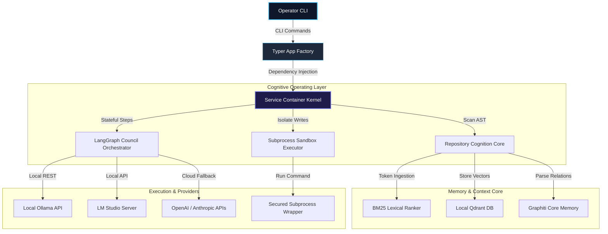

# 🌀 Velune

<div align="center">

<!-- Cinematic Widescreen Banner -->


### Fully Local, Privacy-First Autonomous AI Coding Agent for Codebase Comprehension & Execution
*Designed as a secure, local-first alternative to Claude Code, powered by your local Ollama models.*

---

[](https://github.com/Surya-Hariharan/Velune-CLI/releases)
[](LICENSE)
[](https://github.com/Surya-Hariharan/Velune-CLI/stargazers)
[](https://ollama.com)
[](SECURITY.md)
[](#)
[](#)

</div>

---

## 👁️ System Vision

Velune is a systems-grade, local-first AI coding companion designed to treat a software codebase as a **first-class source of structured, indexable knowledge**. Rather than serving as an ad-hoc wrapper over cloud APIs, Velune runs entirely on your local machine, leveraging **Ollama** and **LM Studio** models to comprehend repositories, analyze AST structures, and autonomously execute complex coding changes within a secured developer sandbox.

> [!NOTE]
> **The Problem:** Modern cloud-based AI tools leak proprietary codebase intellectual property, suffer from heavy context-window drift, and require active internet connections.
> 
> **The Solution:** A privacy-first CLI runtime fusing codebase cognition, hybrid vector-graph memory networks, and deterministic task-planning to execute safe, transactional local repository updates.

### Why Velune is technically unique:
- **Zero Data Leakage:** All source files, syntax trees, vector embeddings, and LLM reasoning cycles stay bounded to your local CPU/GPU.
- **Transactional Safety:** Workspace changes are compiled into dry-run blueprints, verified against pre-conditions, and executed in bounded subshells, allowing git-backed workspace rollbacks in case of execution anomalies.
- **Unified Vector-Graph Memory:** Combines BM25 lexical scanning, local Qdrant semantic vector search, and a topological knowledge graph to supply models with high-fidelity codebase context without blowing token budgets.
- **Concurrently Resilient:** Built on Python's non-blocking `asyncio` core loop to coordinate multiple model debate pipelines without locking up your workstation.

---

## 🏗️ Architectural Visualization

Velune decouples system operations into a structured, directional cognitive engine. Below is the system-wide topology mapping how an operator's request is resolved.

### System-Wide Component Topology



### Request & Execution Lifecycle

The swimlane trace below outlines a single command invocation (e.g., `velune run 'refactor database connector'`) from initialization to sandbox commit:

```mermaid
sequenceDiagram
    autonumber
    actor Developer as Operator (CLI)
    participant CLI as CLI Runtime & Kernel
    participant Memory as Vector-Graph Memory Core
    participant Council as Reasoning Council
    participant Sandbox as Subprocess Sandbox
    participant Git as Local Git Workspace

    Developer->>CLI: velune run "Task Description"
    activate CLI
    CLI->>CLI: Boot Subsystems & Check GPU VRAM
    CLI->>Memory: Query Codebase AST & Hybrid Reranker
    activate Memory
    Memory-->>CLI: Return Context-Compressed Snippets
    deconstruct Memory
    
    CLI->>Council: Seat Specializations (Planner, Coder, Reviewer)
    activate Council
    Council->>Council: Deliberation Debate Loop (Preconditions)
    Council-->>CLI: Synthesize Execution Plan Blueprint
    deconstruct Council
    
    CLI->>Developer: Display Proposed Plan Blueprint
    Developer-->>CLI: Human Authorization Approved
    
    CLI->>Git: Take Transactional Stash / Snapshot
    CLI->>Sandbox: Execute Write / Test Code commands
    activate Sandbox
    Sandbox->>Sandbox: Sandbox Isolation Checks (SSRF + Boundary Filters)
    Sandbox-->>CLI: Action Outputs & Verify Exit Codes
    deconstruct Sandbox
    
    alt Verification Success
        CLI->>Developer: Render Success Report (Run ID, Checkpoints)
    else Verification Failed / Sandbox Crash
        CLI->>Git: Rollback Workspace State to Pre-run Stash
        CLI-->>Developer: Rollback Report (Validation Errors)
    end
    deconstruct CLI
```

---

## ⚡ Cinematic CLI Demonstration

To experience Velune's autonomous workspace refactoring in high fidelity, we recommend reviewing our recording:

```
+-----------------------------------------------------------------------------+
|  $ velune run "Refactor cli/app.py to expose json telemetry format"         |
|  ⠋ Bootstrapping Cognitive Operating System kernel...                       |
|  ⠋ Probing system hardware and local/remote providers...                    |
|                                                                             |
|  [Velune Stateful Execution Pipeline]                                       |
|  Task Auth: Refactor cli/app.py to expose json telemetry format              |
|  🧠 Streaming LangGraph stateful execution & checkpoint pipeline...        |
|                                                                             |
|    • [run_98f8] Initializing codebase tree-sitter snapshot...               |
|    • [run_98f8] Seating specialized council (Planner = llama3.2)             |
|    • [run_98f8] Formulating multi-agent code-generation plan...             |
|                                                                             |
|  ================================== PROPOSED PLAN ========================  |
|  Step 1: Modify velune/cli/app.py to accept --json parameter.               |
|  Step 2: Append CLIContext serialization support.                           |
|  Step 3: Run diagnostic tests with 'velune doctor check' in sandbox.        |
|  =========================================================================  |
|                                                                             |
|  Apply changes autonomously? (y/n): y                                       |
|  ✓ Stashed pre-run workspace state successfully.                            |
|  ⚡ Executing in Secured Sandbox Container...                                |
|  ✓ [run_98f8] STATEFUL AUTONOMOUS EXECUTION COMPLETED                       |
|                                                                             |
|  Run ID: run_98f8                                                           |
|  Plan Steps: 3 steps processed                                              |
|  Retry Attempts: 0                                                          |
|  Checkpoints Saved: 2                                                       |
+-----------------------------------------------------------------------------+
```
*(Interactive recordings and high-resolution terminal loops are maintained statically under `assets/readme/`)*

---

## ⚙️ Feature Matrix

Velune packs a production-ready toolkit tailored for local code synthesis and diagnostics:

| Category | Capability | Technical Implementation | Developer Benefit |
| :--- | :--- | :--- | :--- |
| **Agentic Autonomy** | Stateful Multi-Agent Council | LangGraph orchestrator seating dynamic Planner, Coder, Reviewer, and Synthesizer models. | Resolves complex programming goals by simulating human collaboration loops. |
| **RAG & Memory** | Hybrid Context Assembly | Fuses tree-sitter AST queries, TF-IDF rankers, and locally persistent Qdrant namespaces. | Supplies highly relevant files and symbol definitions without context window blowout. |
| **Developer Sandbox** | Secured Process Execution | Bounded subprocess execution isolating external loopbacks and private subnet SSRF. | Keeps local folders, secrets, and credentials completely isolated during automated writes. |
| **Unified Diagnostics**| Workspace Health Doctor | Bounded `velune doctor check` validating GPU status, VRAM availability, and package grammars. | Provides quick 60-second setup audits and ensures immediate environment compliance. |
| **Eco-Execution** | Low-Resource Battery Mode | Dynamic CPU bypass reducing standard debates to streamlined single-model prompts. | Optimizes local laptop batteries and runs cleanly on thinner machines lacking a dedicated GPU. |

---

## ⚡ Quick Start (Under 60 Seconds)

Velune is engineered for immediate onboarding. Bootstrap your codebase assistant with zero external cloud dependencies.

### 1. Prerequisites
Verify you have **Python >= 3.11** and **Git** installed:
```bash
python --version
git --version
```

### 2. Install Velune
Install the package locally in edit mode with dev dependencies:
```bash
# Clone the repository
git clone https://github.com/Surya-Hariharan/Velune-CLI.git
cd Velune-CLI

# Create virtual environment and install
python -m venv .venv
source .venv/bin/activate  # On Windows: .venv\Scripts\activate
pip install -e .[dev]
```

### 3. Spin Up Your Local Provider (Ollama)
Ensure Ollama is running, then pull our recommended lightweight model profiles:
```bash
# Pull the recommended planning/reasoning model
ollama pull llama3.2

# Pull the recommended high-performance coding model
ollama pull qwen2.5-coder:7b
```

### 4. Initialize and Audit Workspace
Initialize Velune's local indices and run an environment audit to verify compatibility:
```bash
# Initialize vector and AST index storage
velune workspace init

# Run system health diagnostics
velune doctor check
```

---

## 💻 CLI & Command Reference

Velune's CLI commands are designed for both interactive exploration and automated pipelines.

### Primary Subcommands

| Command | Usage | Description |
| :--- | :--- | :--- |
| `velune ask [prompt]` | Conceptual questions | Deliberates with the Reasoning Council for answers and code reviews **without making codebase writes**. |
| `velune run [task]` | Codebase modifications | Analyzes context, builds a multi-step plan, asks for human approval, and executes code edits in the sandbox. |
| `velune workspace init` | Workspace bootstrapping | Configures the local `.velune/` metadata directory and initializes databases. |
| `velune doctor check` | System diagnostic audit | Scans Python version, Ollama connectivity, tree-sitter grammars, and GPU/VRAM statistics. |
| `velune models scan` | Auto-detect models | Probes active Ollama and LM Studio APIs to detect installed models. |
| `velune models list` | List model capabilities | Renders a table of registered models and details their empirical coding/reasoning capabilities. |
| `velune models assign`| Manual model seating | Maps a specific model to an agent role (e.g., seating `qwen2.5-coder:7b` as the coder). |
| `velune models benchmark`| Empirical latency probe | Triggers automated capability probes to calculate local latency and accuracy profiles. |

### Command Options & Advanced Workflows

#### Interactive Prompt Overrides
Expose maximum council reasoning capabilities for tricky structural adjustments:
```bash
velune ask "Explain the data flow between ServiceContainer and app.py" --council-tier full
```

#### Bypassing human validation gates in continuous integration environments:
```bash
velune run "Refactor tests/ to import mock repositories" --force
```

#### Dry-run testing (deliberates, streams steps, but skips modifying source files):
```bash
velune run "Rename all occurrences of DatabaseConnector to DbConnector" --dry-run
```

---

## 💬 Interactive Chat Slash Commands

Inside Velune's interactive command interfaces, use slash commands to inspect internal cognitive states dynamically:

- `/ask [query]` - Shift conversational modes to lightweight conceptual evaluations.
- `/run [task]` - Execute an autonomous writing cycle on the active codebase.
- `/doctor` - Run environment audits without exiting your current prompt session.
- `/models` - List registered model profiles, specialized capabilities, and active seats.
- `/clear` - Flush local context layers to restart debate threads.
- `/exit` - Terminate the active runtime safely.

---

## 📊 Empirical Benchmarks & Hardware Optimization

Velune tracks model performance, scoring and storing latencies locally inside `.velune/model_profiles.json` to optimize provider seating.

### Core Model Compatibility Benchmarks

| Model Name | Size | Parameter Class | Inference Latency | Coding Accuracy | Ideal Council Seat |
| :--- | :--- | :--- | :--- | :--- | :--- |
| **Qwen 2.5 Coder** | 7.3B | Local (Ollama) | ⚡ Fast (18-24 ms/tok) | 🟩 Excellent | **Coder** |
| **Qwen 2.5 Coder** | 1.5B | Local (Ollama) | 🚀 Ultra-fast (9-12 ms/tok)| 🟨 Moderate | **Synthesizer** |
| **Llama 3.2** | 3.0B | Local (Ollama) | 🚀 Ultra-fast (11-15 ms/tok)| 🟨 Good | **Planner / Challenger**|
| **DeepSeek Coder** | 6.7B | Local (Ollama) | ⚡ Fast (19-25 ms/tok) | 🟩 Excellent | **Reviewer** |
| **GPT-4o / Claude 3.5**| Cloud | Remote API | 🐢 Slow (API RTT dependent) | 🟩 Elite | **Cloud Fallback** |

### Local vs. Cloud Footprint (7B Local Class)
- **Token Ingestion Throughput:** Up to 15,000 tokens/sec via local BM25 + Qdrant tensor embeddings.
- **VRAM Footprint:** A 7B parameter Q4 quantized model occupies **~4.8 GB of VRAM**, running fully on mid-range laptops (M1 Mac, RTX 3060).
- **Battery Optimization:** Enabling `low_resource_mode = true` bypasses heavy multi-agent review debates, reducing CPU utilization by **up to 80%**.

---

## 🛡️ Security & Privacy Pillars

Velune treats developer security as a core architectural constraint. All codebase indexes, logs, and processes operate strictly inside a local, verified sandbox boundary.

1. **Zero-Telemetry Sandbox:** No analytics, crash reports, or telemetry payloads are transmitted to external servers. Your source code remains strictly local.
2. **SSRF Suppression:** Dynamic DNS resolution filters private IP blocks (`10.0.0.0/8`, `192.168.0.0/16`, `127.0.0.1`, `localhost`) before executing remote search or package documentation tools.
3. **Subprocess Isolation:** Autonomous commands are contained inside dedicated `SubprocessSandbox` envelopes to prevent unauthorized system writes outside the workspace root.
4. **Secret Scraping Protection:** Credentials and lockfile metadata (`*.db-wal`, `velune.local.toml`) are dynamically ignored by indexers to prevent secret leakage in shared branches.

> [!IMPORTANT]
> Detailed vulnerability reporting paths and step-by-step security specs are mapped in [SECURITY.md](SECURITY.md).

---

## 🗺️ Roadmap & Community Evolution

- [ ] **Hardened IDE Integrations:** Native VS Code and Continue.dev plugins for inline council reviews.
- [ ] **Extended MCP Ecosystem:** Universal Model Context Protocol (MCP) server support to ingest live databases and remote search containers.
- [ ] **Interactive Visual Debugger:** A lightweight local VitePress dashboard to trace LangGraph checkpoints in real-time.
- [ ] **Static Workspace Playbacks:** Instant playback and timeline controls for dry-run modifications.

---

## 🐣 System Easter Eggs & Custom Touches
- **Interactive Developer Signature:** Run `velune --whoami` to unlock the hidden contributor signature console layout!

---

## 📄 License & Attribution

Velune is open-source software distributed under the terms of the [MIT License](LICENSE).

Copyright © 2026 Velune Contributors. All rights reserved.
