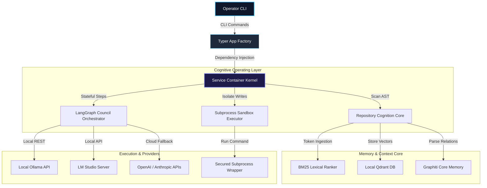
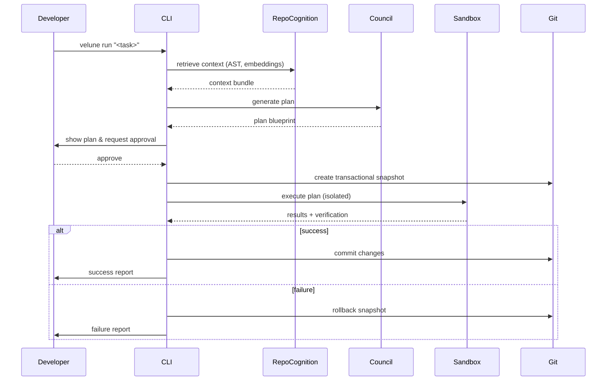

# 🌀 Velune

<div align="center">

<!-- Cinematic Widescreen Banner -->


### Local-first Autonomous Code Companion
Velune is a privacy-focused, developer-centric CLI that understands your codebase, reasons about changes, and applies them safely—without leaving your machine.

Designed for maintainers who need reliable, auditable, and reversible code edits driven by local models (Ollama, LM Studio, or configured fallbacks).

---

[](https://github.com/Surya-Hariharan/Velune-CLI/releases)
[](LICENSE)
[](https://github.com/Surya-Hariharan/Velune-CLI/stargazers)
[](https://ollama.com)
[](SECURITY.md)
[](#)
[](#)

</div>

---

## 👁️ System Vision

Velune treats a codebase as structured knowledge: parseable, searchable, and safely writable. It brings deterministic planning and local model reasoning together so you can automate non-trivial code edits with confidence.

Core principles:
- **Privacy-first:** All analysis and model interactions occur locally by default.
- **Auditable changes:** Proposed plans are presented for review, and edits are applied inside a sandboxed, git-backed transaction.
- **Practical memory:** A hybrid of lexical and vector search (BM25 + Qdrant) provides compact, relevant context to models.
- **Robust concurrency:** Async execution coordinates parallel reasoning agents without blocking development workflows.

---

## 🏗️ Architectural Visualization

Velune decouples system operations into a structured, directional cognitive engine. Below is the system-wide topology mapping how an operator's request is resolved.

### System-Wide Component Topology



### Request & Execution Lifecycle

This section describes the canonical lifecycle for a `velune run` request, broken into discrete phases with clear inputs, outputs, and safety checks.

Phases
- Intake & Parse — The CLI accepts a natural-language task and resolves preliminary intent and scope. Output: a parsed task object and heuristic cost estimate.
- Context Retrieval — The repository cognition core (AST parsers + hybrid retrievers) selects relevant files, symbols, and short context snippets. Output: ranked context bundle.
- Planning & Synthesis — A multi-role council (planner, coder, reviewer) synthesizes a stepwise execution plan with preconditions, rollbacks, and tests. Output: proposed plan blueprint.
- Human Review & Authorization — The proposed plan is presented to the operator for approval or modification. No changes occur until approved.
- Transactional Execution (Sandboxed) — Velune creates a git-backed transaction (stash/branch), executes edits inside an isolated sandbox with strict IO and network guards, and runs verification steps.
- Verification & Checkpointing — Tests and post-condition checks run; successful steps are checkpointed. Failures trigger automated rollback procedures.
- Commit / Finalize — On success, changes are committed (or a patch is emitted); on failure, the workspace is restored and a diagnostic report is produced.

Design guarantees & safeguards
- Human-in-the-loop: The system never writes without explicit approval (configurable for CI with `--force`).
- Sandboxed writes: All runtime modifications occur inside `SubprocessSandbox` with explicit write-path allowlists and time/memory limits.
- Network hygiene: Any external fetch is gated by DNS/IP validation to prevent SSRF or local-network leaks.
- Auditability: Plans, diffs, and checkpoints are logged locally for replay and forensic inspection.

Simplified lifecycle diagram



Example operator commands

Preview mode (no writes):
```bash
velune run "Refactor cli/app.py to expose json telemetry format" --dry-run
```

Full execution (interactive):
```bash
velune run "Refactor cli/app.py to expose json telemetry format"
```

If you'd like, I can expand this section further with a state diagram, timing expectations for each phase, or a small end-to-end log sample. 

---

## ⚡ Cinematic CLI Demonstration

A concise, reproducible example showing how Velune proposes a plan, asks
for approval, and executes changes safely in a sandboxed transaction.

Command
```bash
velune run "Refactor cli/app.py to expose json telemetry format"
```

Trimmed sample output
```text
[velune] Booting kernel and probing providers...
[velune] Proposing plan:
    1) Modify velune/cli/app.py to accept --json
    2) Add CLIContext serialization support
    3) Run diagnostics in sandbox
Proceed? (y/n): y
[velune] Stashed workspace state.
[velune] Executing plan in sandbox...
[velune] Execution completed. Run ID: run_98f8
```

What this demonstrates
- Plan generation with transparent steps presented for review.
- Human approval flow before any workspace modification.
- Sandboxed execution with git-backed rollback and checkpoints.

Reproduce locally (safe preview)
```bash
# ensure dev environment
pip install -e .[dev]
velune workspace init

# preview the plan without applying changes
velune run "Refactor cli/app.py to expose json telemetry format" --dry-run
```

Notes
- The real interactive run includes richer logs and telemetry; use `--dry-run` to preview safely.
- Full recordings and example transcripts are available under `assets/readme/` when present.

---

## ⚙️ Feature Matrix

Velune packs a production-ready toolkit tailored for local code synthesis and diagnostics:

| Category | Capability | Technical Implementation | Developer Benefit |
| :--- | :--- | :--- | :--- |
| **Agentic Autonomy** | Stateful Multi-Agent Council | LangGraph orchestrator seating dynamic Planner, Coder, Reviewer, and Synthesizer models. | Resolves complex programming goals by simulating human collaboration loops. |
| **RAG & Memory** | Hybrid Context Assembly | Fuses tree-sitter AST queries, TF-IDF rankers, and locally persistent Qdrant namespaces. | Supplies highly relevant files and symbol definitions without context window blowout. |
| **Developer Sandbox** | Secured Process Execution | Bounded subprocess execution isolating external loopbacks and private subnet SSRF. | Keeps local folders, secrets, and credentials completely isolated during automated writes. |
| **Unified Diagnostics**| Workspace Health Doctor | Bounded `velune doctor check` validating GPU status, VRAM availability, and package grammars. | Provides quick 60-second setup audits and ensures immediate environment compliance. |
| **Eco-Execution** | Low-Resource Battery Mode | Dynamic CPU bypass reducing standard debates to streamlined single-model prompts. | Optimizes local laptop batteries and runs cleanly on thinner machines lacking a dedicated GPU. |

---

## ⚡ Quick Start

Get Velune running in a few commands.

Prerequisites: Python >= 3.11, Git, and a local model provider if you plan to run local inference (recommended: Ollama).

Install and prepare:
```bash
# Clone and enter
git clone https://github.com/Surya-Hariharan/Velune-CLI.git
cd Velune-CLI

# Create virtualenv and install
python -m venv .venv
# macOS / Linux
source .venv/bin/activate
# Windows (PowerShell)
.venv\Scripts\Activate.ps1
pip install -e .[dev]

# Optional: pull recommended local models (Ollama)
ollama pull llama3.2
ollama pull qwen2.5-coder:7b

# Initialize and audit
velune workspace init
velune doctor check
```

## 🛠️ Development & Contributing

This project welcomes contributors. See `CONTRIBUTING.md` for full guidelines; here are the most common commands when developing locally.

```bash
# Install dev dependencies
pip install -e .[dev]

# Lint and format checks
ruff check .
black --check .
isort --check-only .

# Run tests (fast)
pytest tests/unit -q

# Run full test suite
pytest tests -q
```

Want to contribute? Open a focused PR, include tests, and reference the related issue. Maintain clear commit messages and keep changes small and reviewable.

### Get Involved

- Join conversations by opening issues or PRs.
- Report security issues using the private Security Advisory on GitHub. See `SECURITY.md`.
- Star the repo if you find Velune useful — it helps the project grow.
---

## 💻 CLI & Command Reference

Velune's CLI commands are designed for both interactive exploration and automated pipelines.

### Primary Subcommands

| Command | Usage | Description |
| :--- | :--- | :--- |
| `velune ask [prompt]` | Conceptual questions | Deliberates with the Reasoning Council for answers and code reviews **without making codebase writes**. |
| `velune run [task]` | Codebase modifications | Analyzes context, builds a multi-step plan, asks for human approval, and executes code edits in the sandbox. |
| `velune workspace init` | Workspace bootstrapping | Configures the local `.velune/` metadata directory and initializes databases. |
| `velune doctor check` | System diagnostic audit | Scans Python version, Ollama connectivity, tree-sitter grammars, and GPU/VRAM statistics. |
| `velune models scan` | Auto-detect models | Probes active Ollama and LM Studio APIs to detect installed models. |
| `velune models list` | List model capabilities | Renders a table of registered models and details their empirical coding/reasoning capabilities. |
| `velune models assign`| Manual model seating | Maps a specific model to an agent role (e.g., seating `qwen2.5-coder:7b` as the coder). |
| `velune models benchmark`| Empirical latency probe | Triggers automated capability probes to calculate local latency and accuracy profiles. |

### Command Options & Advanced Workflows

#### Interactive Prompt Overrides
Expose maximum council reasoning capabilities for tricky structural adjustments:
```bash
velune ask "Explain the data flow between ServiceContainer and app.py" --council-tier full
```

#### Bypassing human validation gates in continuous integration environments:
```bash
velune run "Refactor tests/ to import mock repositories" --force
```

#### Dry-run testing (deliberates, streams steps, but skips modifying source files):
```bash
velune run "Rename all occurrences of DatabaseConnector to DbConnector" --dry-run
```

---

## 💬 Interactive Chat Slash Commands

Inside Velune's interactive command interfaces, use slash commands to inspect internal cognitive states dynamically:

- `/ask [query]` - Shift conversational modes to lightweight conceptual evaluations.
- `/run [task]` - Execute an autonomous writing cycle on the active codebase.
- `/doctor` - Run environment audits without exiting your current prompt session.
- `/models` - List registered model profiles, specialized capabilities, and active seats.
- `/clear` - Flush local context layers to restart debate threads.
- `/exit` - Terminate the active runtime safely.

---

## 📊 Empirical Benchmarks & Hardware Optimization

Velune tracks model performance, scoring and storing latencies locally inside `.velune/model_profiles.json` to optimize provider seating.

### Core Model Compatibility Benchmarks

| Model Name | Size | Parameter Class | Inference Latency | Coding Accuracy | Ideal Council Seat |
| :--- | :--- | :--- | :--- | :--- | :--- |
| **Qwen 2.5 Coder** | 7.3B | Local (Ollama) | ⚡ Fast (18-24 ms/tok) | 🟩 Excellent | **Coder** |
| **Qwen 2.5 Coder** | 1.5B | Local (Ollama) | 🚀 Ultra-fast (9-12 ms/tok)| 🟨 Moderate | **Synthesizer** |
| **Llama 3.2** | 3.0B | Local (Ollama) | 🚀 Ultra-fast (11-15 ms/tok)| 🟨 Good | **Planner / Challenger**|
| **DeepSeek Coder** | 6.7B | Local (Ollama) | ⚡ Fast (19-25 ms/tok) | 🟩 Excellent | **Reviewer** |
| **GPT-4o / Claude 3.5**| Cloud | Remote API | 🐢 Slow (API RTT dependent) | 🟩 Elite | **Cloud Fallback** |

### Local vs. Cloud Footprint (7B Local Class)
- **Token Ingestion Throughput:** Up to 15,000 tokens/sec via local BM25 + Qdrant tensor embeddings.
- **VRAM Footprint:** A 7B parameter Q4 quantized model occupies **~4.8 GB of VRAM**, running fully on mid-range laptops (M1 Mac, RTX 3060).
- **Battery Optimization:** Enabling `low_resource_mode = true` bypasses heavy multi-agent review debates, reducing CPU utilization by **up to 80%**.

---

## 🛡️ Security & Privacy Pillars

Velune treats developer security as a core architectural constraint. All codebase indexes, logs, and processes operate strictly inside a local, verified sandbox boundary.

1. **Zero-Telemetry Sandbox:** No analytics, crash reports, or telemetry payloads are transmitted to external servers. Your source code remains strictly local.
2. **SSRF Suppression:** Dynamic DNS resolution filters private IP blocks (`10.0.0.0/8`, `192.168.0.0/16`, `127.0.0.1`, `localhost`) before executing remote search or package documentation tools.
3. **Subprocess Isolation:** Autonomous commands are contained inside dedicated `SubprocessSandbox` envelopes to prevent unauthorized system writes outside the workspace root.
4. **Secret Scraping Protection:** Credentials and lockfile metadata (`*.db-wal`, `velune.local.toml`) are dynamically ignored by indexers to prevent secret leakage in shared branches.

> [!IMPORTANT]
> Detailed vulnerability reporting paths and step-by-step security specs are mapped in [SECURITY.md](SECURITY.md).

---

## 🗺️ Roadmap & Community Evolution

- [ ] **Hardened IDE Integrations:** Native VS Code and Continue.dev plugins for inline council reviews.
- [ ] **Extended MCP Ecosystem:** Universal Model Context Protocol (MCP) server support to ingest live databases and remote search containers.
- [ ] **Interactive Visual Debugger:** A lightweight local VitePress dashboard to trace LangGraph checkpoints in real-time.
- [ ] **Static Workspace Playbacks:** Instant playback and timeline controls for dry-run modifications.

---

## 🐣 System Easter Eggs & Custom Touches
- **Interactive Developer Signature:** Run `velune --whoami` to unlock the hidden contributor signature console layout!

---

## 📄 License & Attribution

Velune is open-source software distributed under the terms of the [MIT License](LICENSE).

Copyright © 2026 Velune Contributors. All rights reserved.
