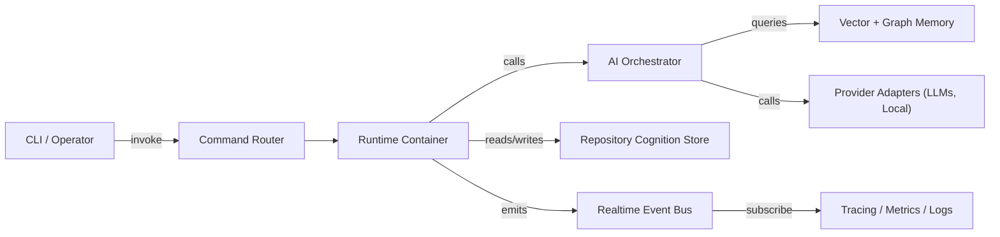
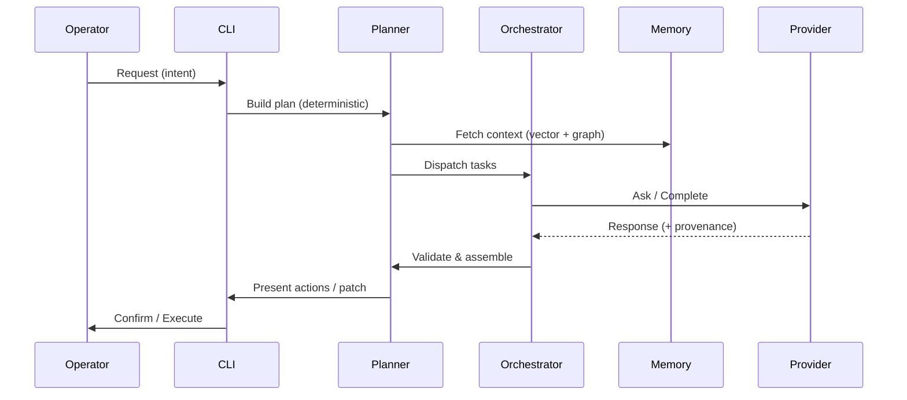
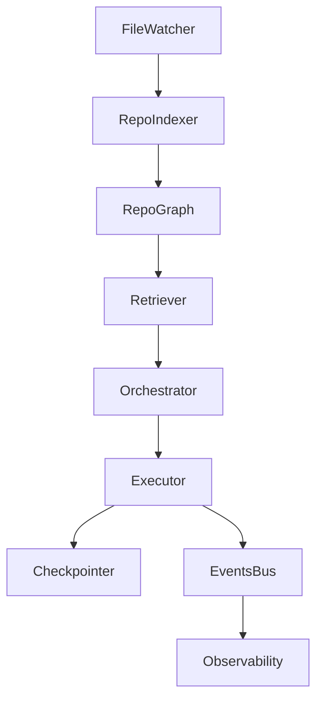

# ---
# title: "Velune CLI"
# description: "Terminal-first cognitive operating layer for repository-aware engineering workflows."
# ---

---
title: "Velune — Cognitive Engineering Platform"
description: "A stealth, production-focused cognitive orchestration platform for repository-aware engineering workflows."
---

<!-- Cinematic hero: high-impact, minimal, technical -->

<div align="center">

{:style="max-width:100%;height:auto;"}

## <span style="font-weight:700;letter-spacing:0.6px">Velune</span>

### A production-grade cognitive engineering platform — stealth, system-first,
designed for deterministic orchestration and high-throughput reasoning.

**Capabilities:**


</div>

---

## System Vision

Velune is engineered to treat a code repository as a first-class source of
structured knowledge and operational context. It is not a toy or a tutorial —
it is a systems-first runtime for safely automating developer workflows,
orchestrating model consumers, and maintaining fidelity between intent and
execution.

- Problem: modern engineering requires continuous, reproducible, and
	accountable automation that reasons about code, tests, and infra.
- Solution: a CLI-centered runtime that fuses repository cognition, vector and
	graph memory, and deterministic orchestration to produce explainable actions.

Why this architecture matters:

- It treats context as a bounded, compressible resource and designs retrieval
	and memory policies accordingly.
- It separates intent, planning, and execution with explicit validation and
	checkpointing boundaries to reduce blast radius for automated actions.
- It is implemented for concurrency, local-first operation, and graceful
	degradation when external providers or infra are unavailable.

Read more in the detailed architecture sections below.

---

## Architecture Showcase

**System architecture (high-level)**



**AI orchestration and request lifecycle**



**Realtime event flow**



Each diagram above is intentionally compact — full-resolution renders are
available in `assets/images/architecture.png` and `assets/readme/README_ASSETS.md`.

---

## Feature Engineering Showcase

The following categories are organized by engineering intent, not marketing.

### AI Orchestration

- Purpose: provide deterministic planning, confidence scoring, and validated
	execution steps derived from multi-model inputs.
- Implementation: modular planner + orchestrator; tasks are pure data objects
	describing preconditions, postconditions, and safe execution envelopes.
- Scalability: planner partitions tasks and parallelizes provider requests
	using async pools and backpressure-aware queues.

### Workflow Automation

- Purpose: encode complex multi-step developer workflows as composable
	artifacts (plans) that can be simulated, validated, and executed.
- Implementation: declarative plan DSL, dry-run mode, and automatic snapshotting
	for rollback; plan fragments are versioned alongside code.

### Observability & Analytics

- Purpose: provide actionable signals for pipeline health, drift, and cost.
- Implementation: structured tracing (OTLP), sampling strategies, cost-aware
	telemetry filters, and provenance metadata attached to every model call.

### Vector Search & Graph Intelligence

- Purpose: fuse semantic retrieval with structural graph edges for precise
	evidence assembly.
- Implementation: local-first vector store with namespace isolation and hybrid
	fusion ranker that weights lexical, vector, and graph signals.

### Realtime Infrastructure

- Purpose: scale event-driven indexing and notification for workspace changes.
- Implementation: lightweight event bus with local persistence, consumer
	groups, and idempotent handlers to support high-throughput indexing.

### Memory Systems

- Purpose: keep short-lived working memory while preserving long-term
	semantic artifacts for later retrieval.
- Implementation: TTL-driven working memory, episodic journaling to graph
	store, and compression policies for low-value content.

---

## Technical Depth

<details>
<summary>Concurrency & Async</summary>

- Model: asyncio-first runtime with careful use of threadpools for blocking IO.
- Pattern: fan-out/fan-in task graphs with bounded semaphores and rate
	limiters per provider.
- Why: predictable CPU / token budgets, reduced head-of-line blocking.

</details>

<details>
<summary>Caching & Optimization</summary>

- Multi-layer caching: in-memory LRU for hot artifacts, local disk cache for
	embeddings and provider responses, and a configurable TTL layer.
- Deduplication: content hashing at ingestion to avoid repeated embeddings and
	provider requests.

</details>

<details>
<summary>Event-Driven Architecture & Fault Tolerance</summary>

- Events are stored with idempotency keys and replayable snapshots to enable
	deterministic recovery.
- Checkpointing: executor publishes commit points; failed runs can be rolled
	back or rehydrated into a safe simulator.

</details>

<details>
<summary>Database & Storage Design</summary>

- Graph store: pluggable backend (local graph, Graphiti, or hosted graph DB)
- Vector store: pluggable Qdrant-compatible client with tenancy-aware
	namespaces.

</details>

---

## Visual Richness (placeholders)

- Terminal demo: `assets/terminal/demo.cast` (asciinema / scriptable playback)
- Animated pipeline: `assets/gifs/pipeline-demo.gif`
- Architecture render: `assets/images/architecture.png`

> Tip: produce magnet-style short clips (10–20s) showing plan → orchestrator
> → execution with provenance overlays.

---

## Production Readiness

- Observability: OTLP traces, Prometheus metrics, structured JSON logs.
- Deployment: container-first (WASM/OCI friendly), infra as code templates
	(placeholder), and staged rollouts.
- Environment isolation: explicit `velune.toml` per workspace + opt-in remote
	infra.
- Resilience: retries with jitter, circuit breakers, and health-driven
	failovers.

---

## Security Engineering

- Authentication: operator identity + machine service principals.
- Authorization: RBAC model with scope-limited tokens for execution agents.
- Validation: multi-stage input validation and differential approval for
	destructive actions.
- Audit: immutable action logs and signed checkpoints for accountability.

---

## Developer Experience

- Minimal local bootstrap: `pip install -e .[dev]` and `velune workspace init`.
- Ergonomics: Typer-powered CLI with rich contextual help and discoverability.
- Testing: integration harness with deterministic fixtures and snapshot
	validation.

```bash
pip install -e .[dev]
velune --help
```

---

## Performance & Scalability (technical highlights)

| Aspect | Design | Why it matters |
|---|---|---|
| Concurrency | asyncio, bounded semaphores | predictable resource usage |
| Throughput | async provider pools + batching | cost-effective LLM usage |
| Retrieval | hybrid fusion ranker | precision under scale |
| Storage | pluggable vector/graph backends | operational flexibility |

Benchmarks and profiles are stored as artifacts in `benchmarks/` and should
include end-to-end latency, provider cost, and memory footprint analyses.

---

## Roadmap & Evolution

<details>
<summary>Short-term (next 3 months)</summary>

- Harden offline simulation and plan replay.
- Add infrastructure templates for staged deployments.

</details>

<details>
<summary>Mid-term (3–12 months)</summary>

- Multi-node orchestration for parallel plan execution.
- Secure multi-tenant memory isolation and policy controls.

</details>

<details>
<summary>Long-term (12+ months)</summary>

- Pluggable governance layer for externally verifiable actions.
- Program synthesis contracts for safe code transformation pipelines.

</details>

---

## Cinematic Extras & Easter Eggs

- Hidden: run `velune --whoami` to reveal a crafted signature message.
- Hacker-terminal aesthetic: `assets/terminal/demo.cast` should include a
	step-by-step run with colored, timed output.

---

## Asset & Badge Recommendations

- Badges (use shields.io): build, coverage, architecture (custom), ai-orchestration,
	security-status.
- Screenshot ideas: pipeline trace, plan validation view, memory graph snippet.
- GIF/demo ideas: 15s run-through of `velune ask` → plan → execute (dry-run).

---

## Appendices

- See `docs/intelligence-foundation.md` and
	`docs/cognitive-architecture.md` for formal subsystem design and diagrams.

---

License: MIT
Copyright © 2026 Velune Contributors
## License

MIT

---
License: MIT
Copyright © 2026 Velune Contributors
