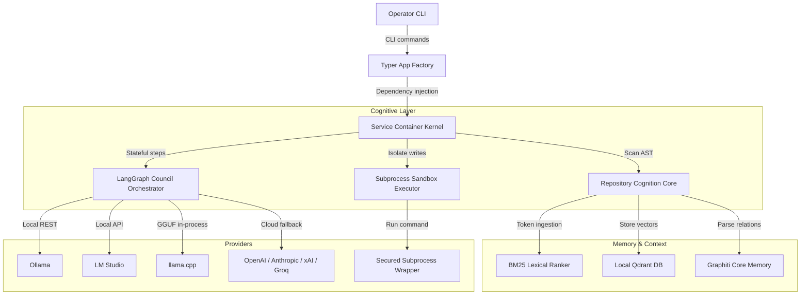
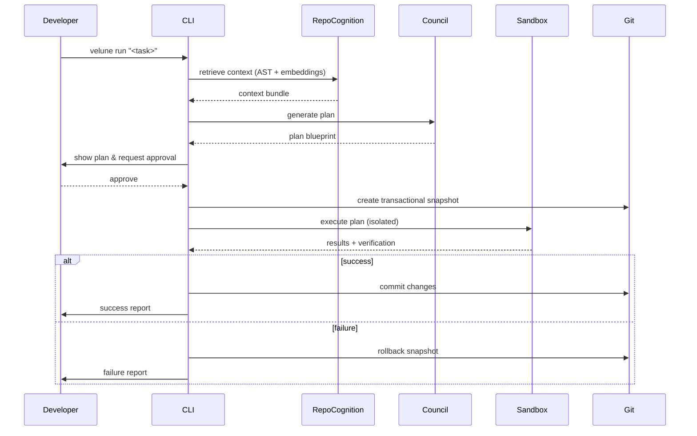

# Velune

<div align="center">

### Local-first Autonomous Code Companion

Velune is a privacy-focused, developer-centric CLI that understands your codebase,
reasons about changes, and applies them safely — without leaving your machine.

Designed for maintainers who need reliable, auditable, and reversible code edits
driven by local models (Ollama, LM Studio, GGUF) with optional cloud fallback.

---

[](https://github.com/Surya-Hariharan/Velune-CLI/actions/workflows/ci.yml)
[](https://github.com/Surya-Hariharan/Velune-CLI/releases)
[](https://pypi.org/project/velune/)
[](https://pypi.org/project/velune/)
[](LICENSE)
[](https://github.com/Surya-Hariharan/Velune-CLI/stargazers)
[](SECURITY.md)
[](https://github.com/Surya-Hariharan/Velune-CLI#quick-start)

</div>

---

## System vision

Velune treats a codebase as structured knowledge: parseable, searchable, and safely
writable. It brings deterministic planning and local model reasoning together so you
can automate non-trivial code edits with confidence.

Core principles:

- **Privacy-first** — all analysis and model interactions occur locally by default.
- **Auditable changes** — proposed plans are presented for review; edits are applied
  inside a sandboxed, git-backed transaction.
- **Practical memory** — a hybrid of lexical and vector search (BM25 + Qdrant)
  supplies compact, relevant context to models.
- **Robust concurrency** — async execution coordinates parallel reasoning agents
  without blocking development workflows.
- **BYOK cloud fallback** — bring your own API keys for OpenAI, Anthropic, xAI,
  Google, Groq, or OpenRouter; all stored securely in your OS keyring.

---

## Architecture

Velune decouples system operations into a structured cognitive engine.



### Request lifecycle



Design guarantees:

- **Human-in-the-loop** — the system never writes without explicit approval
  (configurable for CI with `--force`).
- **Sandboxed writes** — all modifications occur inside `SubprocessSandbox` with
  explicit write-path allowlists and time / memory limits.
- **Network hygiene** — external fetches are gated by DNS / IP validation to prevent
  SSRF or local-network leaks.
- **Auditability** — plans, diffs, and checkpoints are logged locally for replay and
  forensic inspection.

---

## Quick start

**Prerequisites:** Python ≥ 3.11, Git, and a local model provider (recommended: Ollama).

```bash
# Clone
git clone https://github.com/Surya-Hariharan/Velune-CLI.git
cd Velune-CLI

# Create a virtualenv and install
python -m venv .venv
source .venv/bin/activate          # macOS / Linux
.venv\Scripts\Activate.ps1         # Windows PowerShell
pip install -e ".[dev]"

# Optional: pull recommended local models via Ollama
ollama pull llama3.2
ollama pull qwen2.5-coder:7b

# Initialize and audit
velune workspace init
velune doctor check
```

Install from PyPI (stable releases):

```bash
pip install velune
```

---

## CLI reference

### Primary subcommands

| Command | Description |
| :--- | :--- |
| `velune ask [prompt]` | Conceptual questions — reasons with the council, **no codebase writes**. |
| `velune run [task]` | Analyzes context, builds a plan, asks for approval, executes in sandbox. |
| `velune workspace init` | Configures `.velune/` metadata directory and initializes databases. |
| `velune doctor check` | Scans Python version, provider connectivity, tree-sitter grammars, GPU. |
| `velune models scan` | Probes Ollama / LM Studio APIs and GGUF filesystem for installed models. |
| `velune models list` | Renders a table of registered models with capability profiles. |
| `velune models assign` | Maps a specific model to an agent role (coder, planner, reviewer). |
| `velune models benchmark` | Triggers latency and accuracy probes; stores results locally. |
| `velune keys set [provider]` | Save a cloud provider API key to the OS keyring. |
| `velune keys list` | List which cloud providers have a key configured. |

### Common options

```bash
# Expose maximum council reasoning for complex tasks
velune ask "Explain the data flow between ServiceContainer and app.py" --council-tier full

# Skip human approval gate in CI
velune run "Refactor tests/ to import mock repositories" --force

# Preview plan without writing any files
velune run "Rename DatabaseConnector to DbConnector everywhere" --dry-run
```

### Interactive slash commands

Inside the `velune chat` REPL:

| Command | Effect |
| :--- | :--- |
| `/ask [query]` | Shift to lightweight conceptual evaluation mode. |
| `/run [task]` | Execute an autonomous write cycle on the active codebase. |
| `/doctor` | Run environment audits without leaving the REPL. |
| `/models` | List registered model profiles and active seat assignments. |
| `/clear` | Flush local context layers and restart debate threads. |
| `/exit` | Terminate the runtime safely. |

---

## Feature matrix

| Category | Capability | Implementation |
| :--- | :--- | :--- |
| **Multi-agent council** | Planner → Coder → Reviewer → Synthesizer | LangGraph stateful orchestrator |
| **Hybrid RAG** | BM25 + vector search | tree-sitter AST + local Qdrant |
| **Sandboxed execution** | Write-path allowlists, time / memory limits | `SubprocessSandbox` |
| **BYOK cloud** | OpenAI, Anthropic, xAI, Google, Groq, OpenRouter | OS keyring via `keyring` |
| **Local model discovery** | GGUF filesystem scan, Ollama, LM Studio | `LocalModelResolver` |
| **Workspace doctor** | GPU, VRAM, grammar, provider checks | `velune doctor` |
| **Low-resource mode** | Single-model path, no multi-agent debate | `low_resource_mode = true` |
| **Zero telemetry** | No analytics or crash reporting | Local-only by design |

---

## Benchmark reference

Velune tracks latencies locally in `.velune/model_profiles.json`.

| Model | Size | Inference | Coding | Ideal seat |
| :--- | :--- | :--- | :--- | :--- |
| Qwen 2.5 Coder | 7B (Ollama) | 18–24 ms/tok | Excellent | Coder |
| Qwen 2.5 Coder | 1.5B (Ollama) | 9–12 ms/tok | Moderate | Synthesizer |
| Llama 3.2 | 3B (Ollama) | 11–15 ms/tok | Good | Planner |
| DeepSeek Coder | 6.7B (Ollama) | 19–25 ms/tok | Excellent | Reviewer |
| GPT-4o / Claude | Cloud API | API RTT | Elite | Cloud fallback |

A 7B Q4 model occupies ~4.8 GB VRAM and runs on mid-range hardware (M1 Mac, RTX 3060).

---

## Security

Velune treats security as a core architectural constraint.

1. **Zero telemetry** — no analytics, crash reports, or payloads leave your machine.
2. **SSRF suppression** — DNS resolution filters RFC 1918 ranges before any outbound
   socket is created.
3. **Subprocess isolation** — runtime modifications are contained in
   `SubprocessSandbox` with explicit allowlists.
4. **Secret protection** — indexers and commit hooks exclude credential files and
   runtime artifacts by default.

See [SECURITY.md](SECURITY.md) for the full vulnerability reporting process.

---

## Roadmap

- [ ] VS Code and Continue.dev plugins for inline council reviews
- [ ] Universal MCP server support (live databases, remote search)
- [ ] Local VitePress dashboard for tracing LangGraph checkpoints
- [ ] Dry-run playback with timeline controls

---

## Contributing

Contributions are welcome. See [CONTRIBUTING.md](CONTRIBUTING.md) for the full guide.
Quick checklist before opening a PR:

```bash
pip install -e ".[dev]"
ruff check velune/
pytest tests/ -q
```

Report security issues via [GitHub Security Advisories](https://github.com/Surya-Hariharan/Velune-CLI/security/advisories/new) — not public issues.

---

## License

Velune is open-source software released under the [Apache License 2.0](LICENSE).

Copyright 2026 Surya HA
