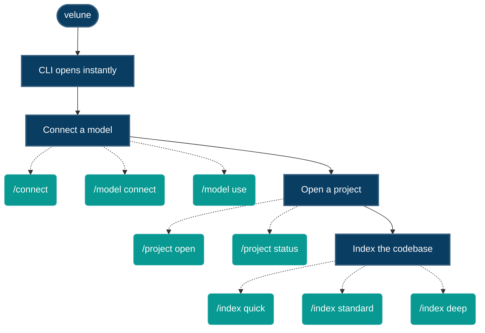

<div align="center">

# Velune CLI

**Local-first multi-model AI developer CLI.**
Council-based agents. Persistent memory. Repository cognition.

No cloud required. No quota. No lock-in.

[](https://pypi.org/project/velune-cli/)
[](https://python.org)
[](LICENSE)
[](https://github.com/Surya-Hariharan/Velune-CLI/actions/workflows/ci.yml)

[Quickstart](#60-second-quickstart) · [Commands](#commands) · [Architecture](#architecture) · [Docs](#project-docs) · [Contributing](#contributing)

</div>

---

## Project identity

Velune CLI is an open-source project originally created and maintained by
**Surya HA**. This repository is the canonical Velune CLI repository; official
releases are the tags and GitHub Releases published here and the
[`velune-cli`](https://pypi.org/project/velune-cli/) package on PyPI.

- **Source code: Apache-2.0.** You are free to use, modify, fork, and
  redistribute it under the terms of the [license](LICENSE) (keep the
  copyright and [NOTICE](NOTICE) attributions).
- **Project identity.** The Velune name, wordmark, logo, and branding are not
  licensed by Apache-2.0 (see [NOTICE](NOTICE) and the [License](#license)
  section). Forks are welcome; they are simply not the canonical project.

See [AUTHORS.md](AUTHORS.md), [GOVERNANCE.md](GOVERNANCE.md), and
[docs/project-origin.md](docs/project-origin.md).

---

## Contents

- [What it does](#what-it-does)
- [60-second quickstart](#60-second-quickstart)
- [Hardware requirements](#hardware-requirements)
- [Startup flow](#startup-flow)
- [Interface](#interface)
- [Providers](#providers)
- [Commands](#commands)
- [Architecture](#architecture)
- [Memory system](#memory-system)
- [Session modes](#session-modes)
- [MCP integration](#mcp-integration)
- [Windows](#windows)
- [Project docs](#project-docs)
- [Optional extras](#optional-extras)
- [Contributing](#contributing)
- [License](#license)

---

## What it does

Velune CLI is a terminal-first AI coding assistant that runs a council of
specialized agents (Planner, Coder, Reviewer, Challenger, Synthesizer) on
your local machine using Ollama, or on free cloud tiers via Groq,
OpenRouter, and others.

|  | Velune CLI | Copilot / Cursor |
| :--- | :--- | :--- |
| **Runs fully offline** | ✅ Yes, via Ollama — no API key | ❌ Always cloud-dependent |
| **Remembers your codebase** | ✅ 5-tier persistent memory across sessions | ⚠️ Per-session context only |
| **Reviews its own output** | ✅ Multi-agent council debates before you see a diff | ❌ Single model, single pass |
| **Editor required** | ✅ None — any terminal, any project | ❌ IDE extension |
| **Your code leaves the machine** | ✅ Never, in local mode | ⚠️ Depends on provider |

---

## 60-second quickstart

### 1. Install Velune CLI

**macOS / Linux / WSL**

```bash
curl -fsSL https://raw.githubusercontent.com/Surya-Hariharan/Velune-CLI/main/scripts/install.sh | sh
```

**Windows (PowerShell)**

```powershell
irm https://raw.githubusercontent.com/Surya-Hariharan/Velune-CLI/main/scripts/install.ps1 | iex
```

The installer puts Velune in its **own isolated environment** using
[uv](https://docs.astral.sh/uv/). It doesn't need Python already installed: if
Python is missing or too old, uv downloads a private copy. It can't conflict
with packages other tools have installed, and it adds `velune` to your `PATH`.
Run the same command again to upgrade.

<details>
<summary><strong>Prefer pipx, uv or pip?</strong></summary>

Any of these works. The first two give you the same isolation as the installer:

```bash
pipx install velune-cli          # isolated, auto-managed PATH
uv tool install velune-cli       # isolated, auto-managed PATH
python -m pip install velune-cli # into the current Python environment
```

Use `python -m pip`, not bare `pip`. That way the package goes into the same
Python you'll run it with, which matters on machines with several Pythons (common
on Windows). Plain pip needs Python 3.10+ and installs into whatever environment
is active. The usual problems with it:

- **`ERROR: Could not find a version that satisfies the requirement velune-cli`**
  (with a note about `Requires-Python`): your Python is older than 3.10. Check
  with `python --version`. Install a newer Python, or use the one-line installer,
  which brings its own.

- **`error: externally-managed-environment`** (Debian/Ubuntu, Homebrew Python):
  the OS won't let pip write to the system Python. Use the installer, `pipx`
  or `uv tool` above, or a virtualenv.
- **Another tool needs different versions of the same libraries:** pip has only
  one copy of each package per environment, so two tools can break each other.
  An isolated install avoids this. If Velune detects an incompatible dependency
  at startup, it names the package and gives you the fix command.
- **`velune: command not found`** / *"'velune' is not recognized…"*: the
  install worked, but your Python scripts directory isn't on `PATH`. Use
  `python -m velune` (always works), or reinstall with `pipx`/the installer,
  which manage `PATH` for you.

Every dependency ships prebuilt wheels for CPython 3.10–3.14 on Windows,
macOS and Linux (x86-64 and ARM64), so no compiler or build step is needed.
CI checks this for the lowest version of each dependency.

</details>

#### Verify the install

```bash
velune --version
velune doctor
```

`velune doctor` shows your Velune version, Python interpreter, OS, and where
Velune is installed and keeps its data. It then checks the installation and
ends with **"✓ Core installation is healthy"** or a list of what's broken.
Optional integrations (provider keys, a local Ollama, extras such as `[rag]`)
are reported but never count as installation failures. The exit code is
non-zero only when the core installation has a problem. `velune doctor --json`
gives the same report as JSON for scripts and bug reports.

### 2a. Local models (Ollama, free, no key)

```bash
# Install Ollama, then pull a model
curl -fsSL https://ollama.com/install.sh | sh
ollama pull qwen2.5-coder:7b

cd your-project
velune init
velune
```

### 2b. Cloud free tier (Groq, fastest, no GPU needed)

```bash
velune init --provider groq
velune setup        # enter your free Groq key
velune
```

Get a free Groq key at <https://console.groq.com/keys>, no credit card needed.

Check your setup any time with `velune doctor`.

---

## Hardware requirements

| RAM | Accelerator | Local LLM? | Recommended setup |
| :---: | :--- | :--- | :--- |
| **< 8 GB** | Any | ❌ No | Use Groq free tier |
| **8 GB** | Integrated | ⚠️ 3B models only | Groq + `phi3-mini` local |
| **16 GB** | Integrated (no dGPU) | ⚠️ Slow, 3B only | Groq + 3B local |
| **16 GB** | 6+ GB VRAM | ✅ 7B comfortable | `qwen2.5-coder:7b` |
| **16 GB** | Apple Silicon | ✅ 13B comfortable | Full council, Metal accel |
| **32 GB** | 12+ GB VRAM | ✅ 13B comfortable | Full council local |
| **36 GB+** | Apple Silicon | ✅ 70B comfortable | Max power, Metal accel |
| **64 GB** | 24+ GB VRAM | ✅ 70B capable | Max power mode |

> Velune CLI detects your hardware on startup and prints tier, GPU, and
> recommendations. On underpowered machines, it routes tasks to cloud
> providers automatically.

---

## Startup flow

Velune CLI starts instantly and does no work until you ask for it. Repository
cognition (indexing) is **explicit and on-demand** — it never runs
automatically on launch.


```mermaid
flowchart TD
    Start([velune]) --> CLI[CLI opens instantly]
    CLI --> Connect[Connect a model]
    Connect -.-> C1("`/connect`")
    Connect -.-> C2("`/model connect`")
    Connect -.-> C3("`/model use`")
    Connect --> Open[Open a project]
    Open -.-> O1("`/project open`")
    Open -.-> O2("`/project status`")
    Open --> Cog[Index the codebase]
    Cog -.-> R1("`/index quick`")
    Cog -.-> R2("`/index standard`")
    Cog -.-> R3("`/index deep`")

    classDef action fill:#0a3d62,stroke:#3c6382,stroke-width:2px,color:#fff;
    classDef cmd fill:#079992,stroke:#38ada9,stroke-width:1px,color:#fff;
    class Start,CLI,Connect,Open,Cog action;
    class C1,C2,C3,O1,O2,R1,R2,R3 cmd;
```

---

## Interface

- **Startup banner** shows your hardware tier, active model, and available providers
- **Responsive prompt** with intelligent context indicators (only displays when relevant)
- **Restrained, single-accent color palette** — clarity over decoration
- **Tab-completion** for every `/` command and for model IDs
- **Session modes** for balancing speed vs. quality (`/fast` · `/normal` · `/max`)
- **Live dashboard** (`/dashboard`) — background jobs, proactive alerts, provider health in one view

The status bar shows `bg:N` for active background jobs, `alerts:N` for unread proactive alerts, and
`mcp connected/total` when MCP servers are configured. Alerts drain automatically after each prompt and
render above the input line.

---

## Providers

| Provider | Type | Cost | Models | Setup |
| :--- | :---: | :--- | :--- | :--- |
| **Ollama** | 🏠 Local | Free | Any pulled model | Install Ollama, pull a model |
| **LM Studio** | 🏠 Local | Free | Any GGUF / MLX model | Launch LM Studio server |
| **llama.cpp** | 🏠 Local | Free | In-process GGUF models | Point at a local `.gguf` file |
| **OpenAI-compatible** | 🏠 Local | Free | vLLM, LocalAI, text-generation-webui, … | Point at your server's base URL |
| **Groq** | ☁️ Cloud | Free tier | Whatever your key can use (e.g. GPT-OSS, Qwen), read live from Groq | `/connect groq` |
| **OpenRouter** | ☁️ Cloud | Pay-per-token | 100+ models | `/connect openrouter` |
| **OpenAI** | ☁️ Cloud | Pay-per-token | GPT-4o family, o-series, GPT-5: chat models your key can use | `/connect openai` |
| **Anthropic** | ☁️ Cloud | Pay-per-token | Claude Opus, Sonnet, Haiku (live list) | `/connect anthropic` |
| **xAI (Grok)** | ☁️ Cloud | Pay-per-token | Grok 2, Grok 2 Mini | `/connect xai` |
| **Google** | ☁️ Cloud | Free quota | Gemini 2.5 Pro/Flash, 2.0 Flash (live list) | `/connect google` |
| **Together AI** | ☁️ Cloud | Pay-per-token | Llama 3.3 70B, Qwen 2.5, DeepSeek R1 | `/connect together` |
| **Fireworks AI** | ☁️ Cloud | Pay-per-token | DeepSeek R1, Qwen 2.5, Mixtral 8x22B | `/connect fireworks` |
| **Mistral** | ☁️ Cloud | Pay-per-token | Mistral Large, Codestral, Mixtral | `/connect mistral` |
| **DeepSeek** | ☁️ Cloud | Pay-per-token | DeepSeek R1, DeepSeek Coder | `/connect deepseek` |
| **Cohere** | ☁️ Cloud | Pay-per-token | Command R+, Command R | `/connect cohere` |
| **Meta (Llama API)** | ☁️ Cloud | Pay-per-token | First-party Llama models | `/connect meta` |
| **NVIDIA NIM** | ☁️ Cloud | Pay-per-token | Llama, Mistral, and other NIM models | `/connect nvidia` |
| **HuggingFace** | ☁️ Cloud | Free/paid | Open models via Inference API | `/connect huggingface` |

> Keys are stored AES-GCM-encrypted in your user config directory; the encryption key lives in your OS
> keyring (or is derived from `VELUNE_MASTER_PASSPHRASE` on headless machines). Never plain text, never
> in git. `velune setup`, `velune provider add <id>` and the REPL's `/connect` all walk you through it.
> Model lists for OpenAI, Anthropic, Gemini and Groq are read live from the provider, so retired models
> drop out automatically.

---

## Commands

### CLI (terminal, before the REPL)

Every top-level command below is grouped exactly as `velune --help` groups
it. Most groups take subcommands — run `velune <command> --help` for the
full signature.

<details open>
<summary><strong>Core</strong></summary>

```bash
velune                    # Start the interactive REPL session
velune chat                # Older line-based chat mode (the full-screen REPL is bare `velune`)
velune run "<task>"        # Run a task non-interactively and exit
velune ask "<question>"    # Ask a one-shot question and exit
velune init                 # Set up Velune CLI in the current project
velune onboard              # Run (or resume) the first-time setup wizard
```

</details>

<details>
<summary><strong>Workspace &amp; Sessions</strong></summary>

```bash
velune project init|status|graph|tree|list|open|resume|explain|forget
velune session list|resume|show|delete|import|rename|search|archive|unarchive|export
```

</details>

<details>
<summary><strong>Setup &amp; Models</strong></summary>

```bash
velune setup                          # Configure providers and models interactively
velune models scan|list|refresh|pull|delete|assign|use|benchmark|health|show
velune provider list|add|remove|test|models|status|api|edit|inspect|default|backup|restore|repair
velune config show|set|get
velune trust add|list|forget
```

</details>

<details>
<summary><strong>Analytics &amp; Monitoring</strong></summary>

```bash
velune usage      # Token usage and estimated cost for recent sessions
velune quota      # Provider rate-limit and quota status
velune health     # Provider reachability and response time
```

</details>

<details>
<summary><strong>Diagnostics</strong></summary>

```bash
velune doctor                         # Diagnose the installation (alias: doctor check)
velune doctor providers|network
velune logs [recent|live]
velune status                         # Index freshness + workspace health
velune pipeline trace "<query>"       # Trace a query through the retrieval pipeline
velune daemon start|stop|status
velune mcp serve|connect <url> <name>
velune memory stats|inspect|clear|compact
```

</details>

<details>
<summary><strong>Trust &amp; Recovery</strong></summary>

```bash
velune backup [--output <path>] [--include a,b] [--with-secrets]   # Snapshot all Velune CLI state to one archive
velune restore <archive> [--include a,b] [--overwrite] [--dry-run] # Restore state from a backup archive
velune recover [id] [--all] [--all-workspaces] [--discard <id>]   # Recover an unsaved session after a crash
```

</details>

### Inside the REPL

52 slash commands across 11 categories (the full table is in [docs/slash-commands.md](docs/slash-commands.md)). The essentials:

<table>
<tr><th>Category</th><th>Commands</th></tr>
<tr><td><strong>Session</strong></td><td><code>/help</code> · <code>/exit</code> · <code>/clear</code> · <code>/new</code> · <code>/fork</code></td></tr>
<tr><td><strong>AI</strong></td><td><code>/run &lt;task&gt;</code> · <code>/council &lt;task&gt;</code> · <code>/jobs</code> · <code>/dashboard</code> · <code>/fast</code> · <code>/max</code> · <code>/normal</code> · <code>/mode</code> · <code>/retry</code></td></tr>
<tr><td><strong>Projects</strong></td><td><code>/project [open|close|status|list|add]</code> · <code>/index [quick|standard|deep|status|rebuild]</code> <em>(alias <code>/cognition</code>)</em></td></tr>
<tr><td><strong>Providers</strong></td><td><code>/connect [provider-id]</code></td></tr>
<tr><td><strong>Models</strong></td><td><code>/model [discover|connect|use|list|status|locate]</code> · <code>/pull</code> · <code>/delete</code> · <code>/roles</code> · <code>/bench</code></td></tr>
<tr><td><strong>Memory</strong></td><td><code>/memory [clear|stats]</code> · <code>/context</code> · <code>/graph</code></td></tr>
<tr><td><strong>Git</strong></td><td><code>/diff</code> · <code>/undo</code> · <code>/hunk</code> · <code>/push</code> · <code>/pr</code> · <code>/issue</code> · <code>/sandbox</code></td></tr>
<tr><td><strong>Tools</strong></td><td><code>/lint</code> · <code>/refactor</code> · <code>/types</code> · <code>/plugin</code> · <code>/hooks</code></td></tr>
<tr><td><strong>MCP</strong></td><td><code>/mcp [servers|tools|resources|connect|disconnect]</code></td></tr>
<tr><td><strong>Resources</strong></td><td><code>/resource [list|discover|connect|status]</code> — Docker, PostgreSQL, MySQL, Supabase</td></tr>
<tr><td><strong>Settings</strong></td><td><code>/settings</code> · <code>/config</code> · <code>/approve [safe|ask|block]</code> · <code>/theme</code> · <code>/crashreports</code></td></tr>
<tr><td><strong>System</strong></td><td><code>/history</code> · <code>/stats</code> · <code>/session</code> · <code>/doctor</code> · <code>/trace</code> · <code>/backup</code> · <code>/restore</code> · <code>/recover</code></td></tr>
</table>

Run `/help` in the REPL for every alias, shortcut, and usage string.

---

## Architecture

<details open>
<summary><strong>Package layout</strong></summary>

```text
velune/
├── cli/              REPL, full-screen UI, slash commands, palettes, themes, onboarding
│   ├── commands/     Typer subcommands (workspace, session, models, doctor, mcp, memory, ...)
│   ├── handlers/     Slash-command implementations (lazily imported)
│   ├── display/      Live dashboards and the council pipeline view
│   └── rendering/    Markdown (tables, charts, Mermaid), error panels, diff fragments
├── providers/        18 providers: adapters, discovery, credentials/crypto, validation, retry
│   ├── adapters/     Per-provider inference + streaming implementations
│   └── discovery/    Model catalog discovery (live-reconciled for OpenAI/Anthropic/Gemini/Groq)
├── models/           Model registry, capability scoring, council role mapping
├── cognition/        Council: Planner -> Coder -> Reviewer -> Challenger -> Synthesizer
│   └── council/      DebateSession, per-role agents, tier classifier, contracts
├── orchestration/    Native tool-calling loop
├── prompt_intelligence/  Provider-aware prompt compiler
├── context/          Context assembly, budgets, token counting, @mentions, prompt caching
├── memory/           working -> episodic -> semantic -> graph -> lineage; SQLite pool, embeddings
├── retrieval/        Hybrid retrieval: BM25 + vector + graph, heuristic reranker
├── repository/       Scanner, AST/symbol index, import graph, blast radius, .veluneignore
├── intelligence/     Repository Intelligence Engine: change detection -> incremental reindex
├── knowledge/        Repository Knowledge Graph: AI-queryable files/symbols/relationships
├── proactive/        Alert store + watcher (CognitiveBus event subscriptions)
├── execution/        Managed execution (allowlist + PATH guard), diff preview, rollback
│   └── edit_formats/ Edit formats: search_replace, udiff, whole_file
├── tools/            File-system, git, web-fetch, and terminal tool implementations
├── mcp/              MCP server + client; stdio / SSE / HTTP / WebSocket transports
├── hooks/            Lifecycle hook dispatcher and executor (pre/post tool events)
├── plugins/          Declarative plugin loader, SKILL.md injection, hook wiring
├── resources/        Resource connectors: Docker, Postgres, MySQL, Supabase (approval-gated)
├── integrations/     GitHub and GitLab REST clients (push, PR, issues)
├── analysis/         Linting, code-smell detection, type inference
├── observability/    Context reports, execution trace log, workspace dependency graph
├── telemetry/        Token tracking, cost estimation, latency profiling
├── recovery/         Unified backup / restore / crash recovery for all persistent state
├── hardware/         Hardware detection, tier classification, GPU probe
├── kernel/ core/     DI container, bootstrap, lifecycle; paths, trust, retry, task registry, errors
├── events.py         The CognitiveBus event bus
└── daemon/           Background service (server + IPC transport)
```

</details>


---

## Memory system

Velune CLI maintains five memory tiers across sessions:

1. **Working** — current conversation turns (in-process, TTL-evicted)
2. **Episodic** — session history (SQLite, stored per workspace in your user data directory)
3. **Semantic** — vector search over past interactions (local LanceDB and Qdrant)
4. **Graph** — entities and relationships seen in conversations and executions
5. **Lineage** — decision history, what was tried and why

This means "fix the auth issue from yesterday" actually works — Velune CLI
retrieves recent sessions, git changes, and related context to reconstruct
intent without you explaining it again.

---

## Session modes

| Mode | Command | Council tier | Model | Context cap |
| :--- | :--- | :---: | :--- | :--- |
| **Normal** | `/normal` | Auto | Current | 16k tokens |
| **Fast** | `/fast` | Instant | Smallest | 4k tokens |
| **Max** | `/max` | Full | Largest | 128k tokens |

> Switch modes at any time mid-session — the prompt badge updates immediately.

---

## MCP integration

Velune CLI works as both an MCP **server** and an MCP **client**:

- **Server** (`velune mcp serve`) — exposes Velune CLI's local tool council over
  stdio so Claude Desktop, VS Code, and other MCP-capable editors can call
  Velune CLI's models without sending your code to a third party.
- **Client** (`velune mcp connect <url> <name>`, or `/mcp connect` in the
  REPL) — connects to any external MCP server, lists its tools, and makes
  them available inside the REPL.
- **Transports** — stdio, SSE, HTTP, and WebSocket (`ws://` / `wss://`) are
  all supported. Servers can also be declared in `.mcp.json` and loaded
  automatically.

Outbound connections to external MCP servers are trust-gated — see
[MCP trust gating](SECURITY.md#mcp-trust-gating) in the security policy.

---

## Windows

Velune CLI runs natively on Windows — native command execution sandboxing,
local Ollama integration, and OS keyring credentials. It also runs
unmodified under WSL2 if preferred.

---

## Project docs

| Doc | What's inside |
| --- | --- |
| [SECURITY.md](SECURITY.md) | Security posture, trust boundaries, reporting |
| [CONTRIBUTING.md](CONTRIBUTING.md) | Dev setup, adding providers/commands/agents, PR workflow |
| [CODE_OF_CONDUCT.md](CODE_OF_CONDUCT.md) | Community standards and enforcement |
| [CHANGELOG.md](CHANGELOG.md) | Full version history |
| [docs/usage-guide.md](docs/usage-guide.md) | Day-to-day tips: tiers, memory, extensions, troubleshooting |
| [docs/slash-commands.md](docs/slash-commands.md) | Every REPL command, alias and usage string |
| [docs/mcp.md](docs/mcp.md) | MCP server + client guide, transports, trust gating |
| [docs/development.md](docs/development.md) | Bootstrap/DI layer, module boundaries, testing, CI, extension points |
| [docs/project-origin.md](docs/project-origin.md) | How the project came to be: releases and milestones |
| [AUTHORS.md](AUTHORS.md) · [GOVERNANCE.md](GOVERNANCE.md) · [NOTICE](NOTICE) | Authorship, governance, licensing notice |

---

## Optional extras

The default install is intentionally lean and pure-python-friendly so it
resolves fast and cleanly on every platform. Heavy or feature-specific
dependencies live in extras — every feature that needs one **degrades
gracefully** when it is absent (e.g. semantic search becomes a no-op, but
lexical search and chat keep working).

| Extra | Installs | Enables |
| --- | --- | --- |
| `[rag]` | `lancedb`, `pyarrow`, `qdrant-client` | Semantic memory + vector retrieval (large compiled wheels) |
| `[parsing]` | `tree-sitter` + grammars | Tree-sitter source parsing for deep repository cognition |
| `[telemetry]` | `opentelemetry-*` | Export spans/metrics to an OTLP collector |
| `[git]` | *(no extra deps)* | Retained for compatibility — git tools (push / PR / issue) now use native `git` subprocess calls, so nothing extra installs |
| `[gguf]` | `gguf` | GGUF file metadata reading — safe, no transitive risk |
| `[docker]` | `docker` | Docker sandbox for isolated code execution |
| `[all]` | everything above | Full-featured install |
| `[dev]` | Test/lint tools | For contributors |

```bash
pip install velune-cli            # lean base (Ollama, cloud providers, chat, lexical search)
pip install 'velune-cli[rag]'     # + semantic memory & vector retrieval
pip install 'velune-cli[all]'     # + every optional feature
```

If you used the one-line installer (or `uv tool`), add extras with
`uv tool install --force 'velune-cli[rag]'`. With pipx, use
`pipx install --force 'velune-cli[rag]'`.

> The former `[llamacpp]` extra has been **permanently removed**:
> `llama-cpp-python` pulls in `diskcache ≤ 5.6.3` (unsafe pickle
> deserialization, no patched version). Install `llama-cpp-python` manually,
> in a trusted single-user environment only, if you accept that risk.

---

## Contributing

See [CONTRIBUTING.md](CONTRIBUTING.md). This developer setup is only for working
on Velune itself. To *use* Velune, follow the [quickstart](#60-second-quickstart)
instead.

Before opening a PR:

```bash
pip install -e ".[dev]"
ruff check velune/
ruff format --check velune/
pyright velune/
pytest -q
```

Report security issues via
[GitHub Security Advisories](https://github.com/Surya-Hariharan/Velune-CLI/security/advisories/new)
— not public issues.

---

## License

Velune CLI is licensed under the [Apache License 2.0](LICENSE).

Copyright 2026 Surya HA

Licensed under the Apache License, Version 2.0 (the "License"); you may not
use this project except in compliance with the License. You may obtain a
copy of the License at <http://www.apache.org/licenses/LICENSE-2.0>, or in the
[LICENSE](LICENSE) file in this repository. Unless required by applicable
law or agreed to in writing, software distributed under the License is
distributed on an "AS IS" BASIS, WITHOUT WARRANTIES OR CONDITIONS OF ANY
KIND, either express or implied.

The Apache-2.0 license applies to the source code. It does not by itself
grant rights to the "Velune" project name, wordmark, or logo — Section 6
("Trademarks") of the [LICENSE](LICENSE) reserves those. This is a
name/branding reservation for the project, not a claim of registered
trademark status.
</content>
