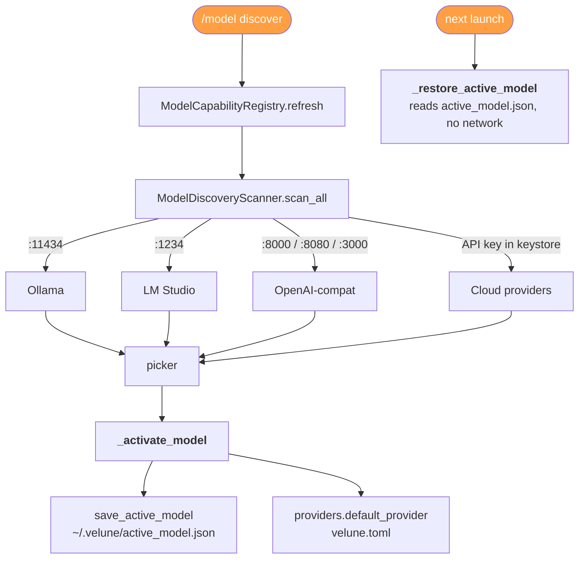

# Architecture — Instant Startup & On-Demand Cognition

This document describes the two-phase model introduced by the startup refactor:
a **lean, instant launch path** and a separate **explicit, user-driven cognition
path**. They never overlap — nothing on the cognition path runs at startup.

When the optional Go launcher is installed, it sits in front of this path only
for process-start fast-paths such as `--version`. All non-trivial commands are
delegated to `python -m velune`, so the Python runtime remains the owner of
configuration, lifecycle, daemon startup, and command policy.

## 1. Startup path (instant, <500ms target)

```mermaid
flowchart TD
    A([velune]) --> B[<b>main()</b> velune/main.py<br/>--version / --help fast-paths]
    B --> C[<b>build_runtime()</b> velune/core/runtime.py<br/>config + logging + console<br/>module bootstrap factories]
    C --> D[<b>REPL handoff</b> cli/app.py -> kernel/entrypoint.py<br/>- lifecycle.startup -> RepositoryCognitionService.initialize <b>(NO-OP)</b><br/>- _restore_active_model<br/>- _show_welcome_guide<br/>- _detect_repo_marker]
    D --> E([PROMPT VISIBLE])

    style A fill:#2e86de,stroke:#0abde3,stroke-width:2px,color:#fff
    style E fill:#10ac84,stroke:#1dd1a1,stroke-width:2px,color:#fff
```

> [!TIP]
> **Allowed at startup**: config, settings, command registry, UI, model registry (lazy), lightweight memory metadata, restore default model.
>
> **Forbidden at startup**: scanning, cognition, embeddings, indexing, chunking, graph/architecture/dependency analysis, RAG/vector build.

## 2. On-demand cognition path (explicit)

```mermaid
flowchart TD
    A([/project open path]) -->|register + activate workspace| B[WorkspaceRegistry<br/>~/.velune/workspaces.json]
    B --> C1([/cognition quick<br/>manifests only])
    B --> C2([/cognition standard | init<br/>file-level symbols])
    B --> C3([/cognition deep | rebuild<br/>symbols+graph+arch])
    
    C1 --> D
    C2 --> D
    C3 --> D
    
    D[<b>Guards</b> cli/repl.py<br/>1. Model ready<br/>2. Unsafe root reason] --> E[<b>preview()</b><br/>_confirm_cognition panel]
    E -->|Confirmed Y| F[<b>_submit_cognition_job</b><br/>JobRegistry + track in background]
    
    F --> G1([/cognition status])
    F --> G2([/cognition cancel])
    F --> G3([/jobs /dashboard])
    
    style A fill:#2e86de,stroke:#0abde3,stroke-width:2px,color:#fff
    style C1 fill:#22a6b3,color:#fff
    style C2 fill:#22a6b3,color:#fff
    style C3 fill:#22a6b3,color:#fff
    style G1 fill:#10ac84,color:#fff
    style G2 fill:#10ac84,color:#fff
    style G3 fill:#10ac84,color:#fff
```

## 3. Safety model

- **`unsafe_index_root_reason(root)`** (`velune/repository/scanner.py`) returns a
  human-readable reason — `"your home directory"` / `"a filesystem root"` — for
  roots that must never be recursively crawled, else `None`. Consulted by
  `RepositoryCognitionService.unsafe_reason()` and `probe_for_changes()`, and by
  every `/cognition` subcommand before any work begins.
- **`_detect_repo_marker(path)`** (`velune/cli/app.py`) looks for `.git`,
  `pyproject.toml`, `package.json`, `Cargo.toml`, `go.mod` and prints an
  *advisory* hint ("Repository detected → run `/project open .`"). It never reads
  contents or triggers indexing.

## 4. Model registry, discovery & persistence



- Discovery is **by model name only** (Rule 6) — `/api/tags` for Ollama,
  `/v1/models` for LM Studio and OpenAI-compatible servers. No filesystem,
  blob, manifest or sha256 paths are ever requested.
- The `openai-compat` provider/adapter pair lets self-hosted OpenAI-compatible
  servers (vLLM, LocalAI, llama.cpp `server`, …) be discovered *and* used; the
  discoverer records each model's endpoint in `metadata["base_url"]`, and the
  adapter's `base_url` defaults to `providers.openai_compat.base_url`.

## Component map

| Concern | Module |
|---------|--------|
| Lean launch / banner / welcome | `velune/cli/app.py`, `velune/core/runtime.py` |
| Lifecycle (inert cognition init) | `velune/kernel/lifecycle.py`, `velune/repository/cognition.py` |
| Cognition entry points | `velune/repository/cognition.py` (+ `scanner.py`, `incremental_indexer.py`) |
| `/cognition`, `/project`, `/model` handlers | `velune/cli/repl.py`, `velune/cli/slash_dispatcher.py` |
| Workspace registry | `velune/cli/workspaces.py` |
| Model registry & discovery | `velune/models/registry.py`, `velune/providers/discovery/*` |
| Model persistence | `velune/cli/model_prefs.py` |
| Background jobs | `velune/core/task_registry.py` (`JobRegistry`, `track()`) |
