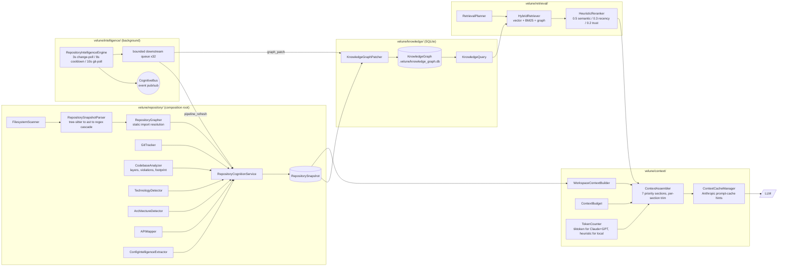
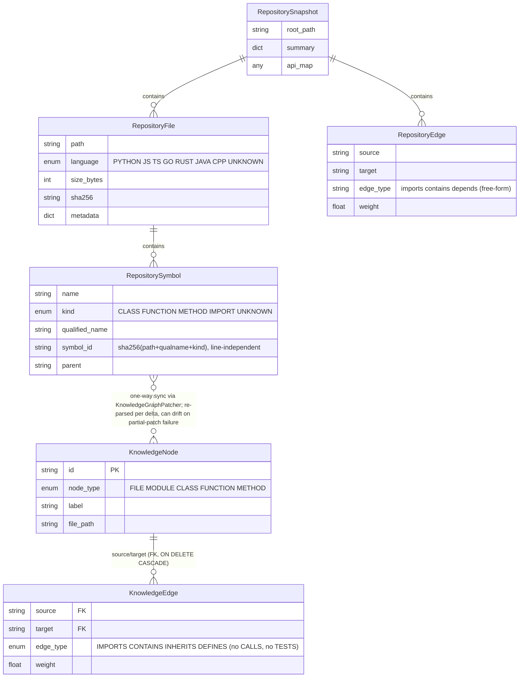

# Repository Intelligence v1 — Baseline Architectural Specification

**Status:** Reverse-engineered baseline, established 2026-07-28, prior to Repository Intelligence v2 design.
**Scope:** `velune/repository/`, `velune/intelligence/`, `velune/knowledge/`, `velune/context/`, `velune/retrieval/` — everything that turns a workspace on disk into what the LLM sees about it.
**Method:** Full source read of all 39 modules in scope, cross-referenced against the live call graph (DI wiring, lifecycle tiers, event bus subscribers), then empirically benchmarked against 8 synthetic repositories spanning well-structured, legacy, notebook-first, ML-pipeline, monorepo, poorly-named, dynamic-import, and polyglot styles. Every claim below is either a direct code citation (`file:line`) or an observed benchmark result; none are speculative.

---

## 1. Executive Summary

Repository Intelligence is not one subsystem — it is **five coordinated subsystems** that happen to share a name:

| Package | Role | Storage |
|---|---|---|
| `velune/repository/` | Discovery, parsing, classification, composition root | JSON files in `.velune/` |
| `velune/intelligence/` | Background incremental-refresh engine + event bus | (stateless; drives the others) |
| `velune/knowledge/` | Persistent import/symbol graph | SQLite (`.velune/knowledge_graph.db`) |
| `velune/context/` | Token budgeting, section assembly, LLM prompt-cache hints | in-memory + fingerprint cache |
| `velune/retrieval/` | Hybrid vector/lexical/graph search + reranking | in-memory, 30s query cache |

The design center of gravity is **`RepositoryCognitionService`** (`velune/repository/cognition.py`), which composes a scanner, parser, grapher, git tracker, and four independent classifiers into one `RepositorySnapshot`. Everything downstream — the knowledge graph, the context builder, the API map — reads from this snapshot or its cached derivatives; nothing re-walks the filesystem on its own.

**The single most important structural fact**: this pipeline was built and hardened almost entirely against **conventionally-shaped, single-manifest, mono-language repositories** (its own reference case is Velune's own codebase, and several hardcoded constants — the internal layer hierarchy, the "fastapi" marker being literally the filename `main.py` — reveal this). It degrades gracefully (never crashes, never blocks the REPL) on everything else, but "graceful" here specifically means **silent underperformance**: wrong labels, empty sections, and dropped edges, never an error the user can act on. Section 6 quantifies exactly how much information is lost per repo style.

---

## 2. Architecture Overview

### 2.1 Package responsibilities and composition root

`RepositoryCognitionService.__init__` (`cognition.py:43-64`) owns:
- `RepositoryIndexer` — file discovery + parsing → per-file symbols
- `RepositoryGrapher` — import edge resolution, `networkx.MultiDiGraph`
- `GitTracker` — branch/commits/volatility/blame
- `CodebaseAnalyzer` — layer classification, dependency-violation detection, framework footprint

Four additional classifiers are constructed on demand by `_run_pipeline()` (`cognition.py:659-782`) rather than owned by the service: `TechnologyDetector`, `ArchitectureDetector`, `APIMapper`, `ConfigIntelligenceExtractor`. A **separate**, root-only `ProjectTypeDetector` (`project_type.py`) and a **third**, same-named `ProjectTypeDetector` inside `analyzer.py` also exist — three independent "what kind of project is this" implementations that do not share state or reconcile their answers (§4.1).

Registration into the app is via `velune/repository/subsystems.py` — a thin DI factory registering the service under `runtime.repository_cognition`, lifecycle key `"repository"`. `velune/intelligence/subsystems.py` and `velune/knowledge/subsystems.py` do the same for the engine and the knowledge graph, both as **Tier-1 background** modules (`velune/kernel/modules.py:19-54`) — they warm up after the first prompt is already possible, not before.

### 2.2 System diagram

See the Eraser architecture diagram (linked at the end of this document) for the full component graph. In text form, the flow is:

```
FilesystemScanner ──files──▶ RepositorySnapshotParser ──symbols/edges──▶ RepositoryGrapher
                                                                              │ resolves imports
GitTracker ─────────────────────────────────────────────────────┐           ▼
                                                                  ▼      RepositorySnapshot
TechnologyDetector, ArchitectureDetector, APIMapper,        (assembled by
ConfigIntelligenceExtractor ────────────────────────────▶   RepositoryCognitionService)
                                                                  │
                     ┌────────────────────────────────────────────┼─────────────────────────┐
                     ▼                                             ▼                          ▼
         WorkspaceContextBuilder                     KnowledgeGraphPatcher (via          RetrievalPlanner /
         (repository/context_builder.py)              intelligence/engine.py)            BM25 doc index
                     │                                             │                          │
                     ▼                                             ▼                          ▼
              ContextAssembler  ◀───────────────────── KnowledgeQuery ◀── SQLite KG   HybridRetriever
              (context/assembler.py)                                                          │
                     │                                                                         │
                     └──────────────────────────────── ContextChunk(RETRIEVED_CONTEXT) ◀───────┘
                     ▼
              final prompt → LLM
```

### 2.3 Triggers — what actually causes indexing to happen

There is **no single entry point**; four independent triggers exist (`cognition.py:85-96`, `cli/handlers/cognition.py:371-403`, `intelligence/engine.py:63-249`):

1. **REPL entry** — `auto_detect_on_entry()` fires a fast, non-blocking `quick_summary()` plus (if enabled) an incremental background index job.
2. **Continuous polling** — `RepositoryIntelligenceEngine` runs a `_change_detection_loop` every 3 seconds once started, with an 8-second cooldown after each detected change to absorb bursty writes (`npm install`, codegen).
3. **Manual `/cognition` command** — user-forced `quick` / `standard` / `deep` runs.
4. **Per-turn cache read** — `get_snapshot_fresh()` never blocks on a rescan; it reads whatever the background engine last computed, falling back to synchronous full indexing only on a true cold start.

`RepositoryCognitionService.index()` itself is explicitly documented as synchronous and slow (`cognition.py:262-267`) — calling it from a coroutine directly would freeze the REPL for the full walk duration. The engine's job is entirely to make sure that call is rare.

---

## 3. Execution Flows

### 3.1 Cold start (first prompt in a brand-new workspace)

1. REPL starts → `auto_detect_on_entry` fires a background incremental-index job (does not block prompt entry).
2. `RepositoryIntelligenceEngine.initialize()` runs (Tier-1, non-fatal on failure) — seeds git state, ensures the SQLite KG schema exists.
3. User sends first prompt → `build_turn_context()` calls `get_snapshot_fresh()`. If the background job from step 1 hasn't finished, this call performs the **synchronous full index** in-line — full scan, full parse, full graph build, full classification. This is the only place cold-start cost is actually paid by a user-facing action, and it is unbounded (§5).
4. `_repository_snapshot_chunks()` has a 5-second timeout on this path (`prompt_context.py:456-462`) — if indexing takes longer, the turn proceeds with **zero repository context** rather than blocking, silently.

### 3.2 Steady-state turn (warm cache, background engine running)

1. Engine's `_change_detection_loop` ticks every 3s: `IncrementalIndexer.compute_delta()` does a fast git-SHA + `git status --porcelain` check (~5ms when clean) and returns an empty delta with **zero file I/O** if nothing changed.
2. On a real delta, the engine enqueues `graph_patch` / `pipeline_refresh` tasks onto a bounded (32-slot) queue; a `_downstream_worker` drains them off the event loop via `asyncio.to_thread`.
3. `KnowledgeGraphPatcher` re-parses only the changed files and does a delete-then-reinsert into SQLite — proportional to change size, not repo size.
4. `RepositoryCognitionService.refresh_pipeline_cache()` re-runs the grapher/API-map/architecture chain scoped to the delta and writes `.velune/pipeline_cache.json`.
5. User sends a prompt → `build_turn_context()` fans out **four concurrent, independently-degrading** retrieval sources (`prompt_context.py:128-133`): hybrid file/code retrieval, memory-lifecycle (semantic/episodic/KG), lineage/decisions, and the repository snapshot/architectural-drift block. Each has its own timeout; any subset can fail without blocking the others.
6. `ContextAssembler.assemble()` packs the results into 7 canonical sections, applies per-section trimming, and emergency-drops the entire `RETRIEVED_CONTEXT` section if still over budget.
7. Result is wrapped as a single system message and sent with the user's turn.

### 3.3 Incremental re-index decision tree

```
compute_delta()
 ├─ git available?
 │   ├─ HEAD unchanged AND working tree clean → empty delta, ~5ms, no I/O
 │   └─ else → full filesystem walk (scanner or Rust-native fallback)
 │         for each discovered file:
 │           stat() matches stored (mtime, size)? → skip (no hash, no read)
 │           else → SHA-256 hash → compare to stored hash
 │             changed/new → to_add / to_update
 │         stored-but-missing-on-disk → to_remove
 └─ no git (no .git dir, or git subprocess times out at 5s) → assume dirty, always full walk
```

Renames are **not** detected as renames — they compute as a `to_remove` + `to_add` pair, meaning anything keyed by the old path (symbol IDs, staleness trackers) goes stale until the next successful patch cycle recreates it under the new path.

---

## 4. Assumptions Catalogue

Every assumption below was confirmed either by direct code citation or by an observed benchmark result (§6).

### 4.1 Classification assumptions
- **Root-manifest-only for two of three type detectors.** `ProjectTypeDetector` (`project_type.py:144-148`) and `TechnologyDetector`'s primary path only read root-level `package.json`/`pyproject.toml`/etc. A nested-only manifest (`packages/backend/pyproject.toml` with no root Python manifest) is invisible to these two. The third path — `CodebaseAnalyzer.detect_framework_footprint()` — is content-based and recursive, and is what actually rescues monorepo detection in practice (confirmed in §6.5).
- **First-match-wins across languages.** `project_type.py`'s `_classify()` returns at the first matching marker in a fixed priority order (Rust → Go → Flutter → .NET → Node → Python → Java). A repo with both `Cargo.toml` and `pyproject.toml` reports only one stack.
- **Filename-based framework markers, not content-based.** `analyzer.py:35` — `"fastapi": ["main.py", "app/main.py", "api/main.py"]` — any repo with a root `main.py` is labeled a FastAPI project by this path regardless of what the file contains. Confirmed as a live false positive in §6.6.
- **Fixed folder-name vocabulary for architecture/layer detection.** `architecture_detector.py`'s feature-finder and `analyzer.py`'s `_GENERIC_LAYERS` both match a hardcoded set of ~30 English folder names (`controllers`, `services`, `auth`, `checkout`, ...). Non-matching names (single letters, abbreviations, non-English) produce zero features and an "Unknown" architecture pattern — not a lower-confidence answer, just an empty one.
- **Config intelligence stops at the first non-empty file**, in fixed priority `pyproject.toml → package.json → Cargo.toml → go.mod` (`config_intelligence.py:80-103`) — it does not merge across a polyglot repo's multiple config files.
- **API route/DB-query extraction is single-line regex per known framework**, with **no generic fallback**. Unrecognized frameworks (GraphQL, gRPC, tRPC, DRF class-based views/ViewSets, chained route registration) produce zero routes, not a degraded partial result. DB-query-to-route association is purely positional (same file, within 80 lines) — a service-layer split defeats it entirely.

### 4.2 Parsing assumptions
- **Structured (AST/tree-sitter) parsing covers 5 languages** (Python, TypeScript, JavaScript, Go, Rust) plus a 6-language regex fallback (adds Java, C++). Everything else in the ~50-extension discovery allowlist — Ruby, PHP, Swift, Kotlin, SQL, shell, Vue, Svelte, HTML, GraphQL, Dart, and a dozen more — is discovered, hashed, and cached, but yields **zero symbols**, always, with no error surfaced.
- **UTF-8 assumed everywhere**, `errors="ignore"` as the universal fallback — non-UTF-8 content is silently corrupted at decode boundaries, not detected or skipped.
- **No file-size ceiling in the core indexer or grapher.** `RepositoryIndexer.index()` reads and fully parses every file regardless of size; the only caps that exist (`api_mapper.py` at 512KB, framework-footprint detection at 100KB) are in downstream analyzers, not the indexer itself. Confirmed catastrophically in §6.4.
- **Static, string-literal-anchored import resolution only.** No execution, no `importlib`/`require(variable)`/computed-path resolution. Confirmed in §6.3.
- **Whole-file invalidation granularity** — any byte change forces a full re-parse of that file; there is no symbol-level diffing.
- **Parse and per-file exceptions are swallowed almost entirely silently** — `RepositoryIndexer.index()`'s per-file loop is a bare `except Exception: pass` with no logging (`indexer.py:216-218`); a systematically broken file (e.g. genuinely corrupt encoding) degrades to "zero symbols" indistinguishable from "this file legitimately has no symbols."

### 4.3 Storage/concurrency assumptions
- **Two independent writers share `index_state.json`** (`RepositoryCognitionService` and `RepositoryIntelligenceEngine`) with no locking beyond atomic temp-file-plus-`os.replace` — concurrent writes can still race at the whole-file level (last-write-wins).
- **Knowledge-graph patch is not transactionally atomic across the whole operation** — delete and reinsert are separate SQLite transactions; a crash mid-patch can leave deleted-but-not-reinserted nodes until the next successful delta.
- **No file-count or depth cap anywhere in discovery** — the only cold-start guard is refusing to index the literal home directory or a drive root; an otherwise-normal repo of any size is walked in full.

### 4.4 Context/budgeting assumptions
- **Token counting for Claude is not Claude's tokenizer.** `TokenCounter` routes both `ModelFamily.GPT` and `ModelFamily.CLAUDE` through OpenAI's `tiktoken` (`cl100k_base`/`o200k_base`) — there is no Anthropic-native tokenizer in this module. All local/unknown-family models (Ollama, Qwen, Llama, Mistral) fall back to a `words × 1.35` heuristic with no relationship to their real BPE vocabularies. A heuristic under-count could let assembled context silently exceed a local model's real window while Velune's own bookkeeping reports it as under budget.
- **`REPOSITORY_SNAPSHOT` truncation is a hard character-boundary cut** at the nearest newline with no language- or symbol-boundary awareness — it will as readily cut mid-class as at a natural boundary.
- **The final over-budget safety valve is all-or-nothing**: if assembled context still exceeds budget after section-level trimming, the *entire* `RETRIEVED_CONTEXT` section is dropped — not a final top-up pass that keeps the highest-value fraction.
- **Repository-context freshness is bounded, not guaranteed**: a very recent edit may not be reflected in `REPOSITORY_SNAPSHOT`/`ARCHITECTURAL_DRIFT` if the background engine hasn't caught up yet; this is an explicit, deliberate latency-over-freshness tradeoff (5s timeout → degrade to no repo context, never block).

---

## 5. Scalability Analysis

| Dimension | Behavior | Evidence |
|---|---|---|
| Repo file count | Unbounded, linear walk cost, no cap | `unsafe_index_root_reason` only guards home-dir/drive-root, `scanner.py:171-190` |
| Individual file size | Unbounded in the core indexer/parser; downstream caps (512KB API-mapper, 100KB footprint) do not protect the indexer itself | `indexer.py:175`, confirmed §6.4 |
| Vendored/generated/build directories | Excluded from *discovery* by name for common cases (`node_modules`, `dist`, `.next`, caches) but **not** `vendor/`, `third_party/`, or arbitrary generated-client directories | grep confirmed: zero occurrences of "vendor"/"third_party" in scanner.py, api_mapper.py, incremental_indexer.py |
| Steady-state (no changes) | ~5ms per poll tick via git-SHA fast path — genuinely cheap | `incremental_indexer.py:148-167` |
| Steady-state (small delta) | Proportional to changed-file count, not repo size, both for re-indexing and for KG patching | `graph_patcher.py:9-10` |
| Cold start / no-git repos | Always pays the full walk + full parse on every dirty check — there is no non-git fast path | `_working_tree_is_clean` returns `False` when no `.git` present |
| Knowledge-graph reads | Disk-backed (SQLite, not in-memory), so node/edge growth is bounded by disk not RAM — but `subgraph()`/`get_nodes_by_type()` BFS/scan results have no cap beyond `find_by_label`'s 50-row limit | `knowledge/graph.py:359-397` |
| Downstream task queue | Bounded at 32 slots, silently drops tasks when full under sustained rapid changes — a bounded-staleness tradeoff, not a crash risk | `intelligence/engine.py:419-424` |
| Context assembly | O(chunks) sort + greedy fill per section; cheap regardless of repo size since it operates on the already-produced, budget-capped snapshot text, not raw files | `context/assembler.py` |

**The dominant scalability risk is not repo size — it's the absence of a size/vendor filter at the parsing layer.** A repository with even one large generated or vendored file inside a directory name the scanner doesn't recognize will have its indexing cost and symbol/edge counts dominated by that file, independent of how large or small the actual first-party codebase is. §6.4 demonstrates this is not theoretical.

---

## 6. Benchmark Results — 8 Synthetic Repository Styles

All repos were indexed directly via `RepositoryCognitionService(path).index(force=True)`, bypassing the REPL/CLI shell to measure the subsystem in isolation. Full JSON output is available on request; the table below is the distilled signal.

| Repo style | Files | Symbols | Edges | Index time | Detected stack | Architecture pattern | Notable finding |
|---|--:|--:|--:|--:|---|---|---|
| `well_structured` (clean FastAPI layering) | 7 | 22 | 22 | 0.29s | Python / FastAPI | **FastAPI MVC** | Baseline — works as designed. `.env` secret correctly excluded; injected-prompt comment correctly sanitized. |
| `legacy_php_style` (PHP + old-style JS) | 4 | 2 | 2 | 0.03s | `js_generic` only | Unknown | **All 3 PHP files get 0 symbols and `language: unknown`.** PHP is entirely invisible to type detection — a PHP app is classified purely by its one incidental `.js` file. |
| `notebook_ml` (2 Jupyter notebooks + 1 helper module) | **1** | 2 | 2 | 0.03s | Python (generic) | Unknown | **Both `.ipynb` files are never discovered at all** — `.ipynb` is absent from the ~50-extension allowlist. The two notebooks containing the actual exploratory/training code are 100% invisible; only the one plain `.py` helper is indexed. |
| `ml_pipeline` (train/preprocess/model + a vendored 60K-line file) | 4 | **20,013** | 20,015 | **4.32s** | Python (generic) | Unknown | **The vendored file alone accounts for 99.99% of all symbols and the entire index-time cost**, on a repo whose real payload is 3 small files. No vendor/size guard exists to prevent this. |
| `monorepo` (root workspaces + nested per-package manifests) | 4 | 7 | 8 | 0.04s | JS root label, but `is_monorepo: true`, frameworks `[FastAPI, React]` | Unknown | Root-only detector alone would miss the nested `backend-api` Python package entirely; **content-based footprint detection recovers it** — a real defense-in-depth win, though the single `tech_stack.language` field still collapses to one language string. API map correctly resolved the one FastAPI route + 2 frontend calls across package boundaries. |
| `poorly_named` (single-letter dirs, terse filenames) | 4 | 12 | 15 | 0.03s | **`fastapi`** (false), framework `SQLite` | **Unknown, 0 features** | AST parsing/import resolution works fine regardless of names (confirms parsing is name-agnostic) — but **all 4 files fall into the "other" layer bucket** (folder-name heuristics found nothing), and the repo was mislabeled `fastapi` purely because it happens to have a root `main.py` (§4.1, `analyzer.py:35`) — it uses no web framework at all. |
| `dynamic_imports` (Python `importlib`, JS `require(var)`) | 5 | 9 | 10 | 0.18s | `fullstack_py_js` | Unknown | Folder-name heuristic *did* correctly bucket the 3 plugin files into a `plugins` layer — but the dependency graph captured **only 1 import edge**; the loader→plugin relationships that exist purely via `importlib.import_module(f"plugins.{name}")` and `require(modPath)` are entirely absent from the graph. Blast-radius/impact analysis on this codebase would be blind to its actual plugin-loading structure. |
| `mixed_lang_polyglot` (Rust core + Python wrapper, both manifests at root) | 2 | 5 | 5 | 0.05s | **Python only** | Unknown (entry point mislabeled `.rs` file) | Confirms the first-match-wins/single-stack-label problem from a different angle than predicted: `technology_detector` reported `language: Python`, and the Rust core — arguably the more structurally important half of this repo — never appears in `tech_stack` or `frameworks_detected` at all. |

### 6.1–6.8 Narrative highlights

**6.1 — Baseline validity.** `well_structured` confirms the pipeline works exactly as intended on its home turf: correct layer assignment, correct route extraction, correct framework detection, correct secret exclusion, correct prompt-injection sanitization (logged once as a summary WARNING, per-file detail suppressed to DEBUG — exactly matching the documented design).

**6.2 — PHP is a total blind spot, and it's silent.** Not one PHP file produced a parse error or a warning; they simply contribute nothing. A team using Velune on a legacy PHP codebase would get an "Unknown" architecture and zero symbol-level intelligence with no indication that the tool doesn't support their language — the summary counts (7 files, N symbols) look superficially like it worked.

**6.3 — Jupyter notebooks are not files, structurally.** This is arguably the sharpest finding for ML-workflow repos: the extension simply isn't in the discovery allowlist. Every downstream feature — symbol search, import graph, blast radius, API mapping — operates as if the notebooks don't exist, even though in a typical data-science repo they contain the majority of the meaningful code.

**6.4 — One unguarded file can dominate the entire snapshot.** The 800KB/60,000-line vendored file, sitting in a directory named `vendor/` (a name the scanner does not recognize), was fully AST-parsed, producing one `RepositorySymbol` per function — over 20,000 of them — and pushing index time from a expected ~30ms (matching the other small repos) to 4.3 seconds. Every downstream consumer of `RepositorySnapshot` (context builder, architecture layer stats, high-volatility file ranking, blast-radius counts) now has its signal-to-noise ratio destroyed by this one file for as long as it's present.

**6.5 — Monorepo detection has real defense-in-depth, but a thin single-language label on top.** The nested-manifest blind spot predicted from the code read did **not** fully materialize in practice, because `CodebaseAnalyzer.detect_framework_footprint()`'s content-based, recursive scan compensates for the root-only detectors. This is a genuine strength worth preserving in v2. What doesn't fully work: `tech_stack.language` is still a single string (`"JavaScript"` here), so a caller reading only that field — as several context-rendering code paths do — still sees a one-dimensional answer about a two-language repo.

**6.6 — A filename can be a framework.** `poorly_named`'s misclassification as `fastapi` is not a fuzzy heuristic gone slightly wrong — it is a deterministic, always-true rule: *any* repository with a root `main.py`, `app/main.py`, or `api/main.py` is labeled FastAPI by `analyzer.py:35`, independent of file content. This is worth flagging distinctly from the "no features detected" finding, because it's actively wrong rather than merely absent.

**6.7 — Dynamic import patterns are invisible, and this matters most for exactly the architectures that use them.** Plugin systems, dependency-injection containers, and lazy-loaded route registries are common precisely in larger, more mature codebases — and precisely those codebases will have the emptiest, least-useful dependency graphs from this pipeline, since every relationship mediated by a computed import string is dropped silently at the parser level (string-literal-anchored regex/AST node matching never sees it).

**6.8 — Polyglot repos always lose a language, not just a manifest.** Whether by first-match-wins priority (`project_type.py`) or by whatever `TechnologyDetector`/`analyzer.py` used to arrive at "Python only" for a Rust+Python repo, the practical effect for a user is the same: half their stack is absent from every context block that reads `tech_stack.language`/`.framework` as a scalar.

---

## 7. Strengths

- **Layered fault isolation.** Nearly every stage — per-file parsing, per-source retrieval, per-section context trimming — is individually try/excepted and degrades to "less signal" rather than raising. The system never crashes a turn because one file, one detector, or one retrieval source failed; this is a deliberate and consistently-applied design principle, not an accident.
- **Genuine incrementality where it matters most.** The git-SHA-plus-clean-tree fast path makes steady-state polling essentially free (~5ms), and knowledge-graph patching is proportional to change size, not repo size — this is real engineering, not a nominal "incremental" label.
- **Defense-in-depth on classification.** The monorepo benchmark (§6.5) shows that even though the primary/root-only detector is weak, a secondary content-based footprint scanner recovers real signal — multiple independent heuristics compensate for each other more often than the code-read alone would suggest.
- **Security-conscious by default.** Secret-file exclusion and prompt-injection sanitization both worked correctly and silently in the benchmark, and are structurally separated from the parsing path (gated before content is ever handed to a parser or an LLM-facing renderer).
- **Correctness-preserving caching.** The Anthropic prompt-cache layer (`context/cache/`) cannot produce wrong context under any fingerprint-mismatch condition by construction — it only adds cache hints, never withholds content. The 30-second retrieval-planner cache and the missing `invalidate()` call sites are the closest thing to a real staleness gap in the whole caching story, and both are self-correcting via content hashing rather than silent.
- **Cycle-safe graph traversal.** `KnowledgeGraph.subgraph()`'s visited-node/visited-edge BFS correctly terminates on circular imports without special-casing them — a sign the graph layer was built with real-world import cycles in mind.

## 8. Weaknesses

- **Classification failures are indistinguishable from absence of the thing being classified.** "Unknown" architecture, empty `features`, zero routes — these are the same output whether the repo genuinely has no discernible pattern or whether the heuristic simply didn't recognize non-English/abbreviated/unconventional names. There is no confidence score or "detection inconclusive" signal anywhere in this pipeline, so the LLM (and the user, if this were surfaced) cannot tell the two cases apart.
- **No generic/fallback path for unsupported languages or frameworks.** Every extraction step (symbol parsing, route mapping, project-type detection) is a closed enumeration; anything outside it contributes zero information rather than a degraded-but-present one. This is the direct cause of §6.2 and the API-mapper's blindness to GraphQL/gRPC/tRPC/DRF.
- **Static-only import resolution with no dynamic-import awareness at all.** Not a partial gap — computed/dynamic import targets are categorically outside what the AST/tree-sitter/regex extractors can represent, since they all anchor on string-literal module paths.
- **No content-size or vendor/generated-code filtering at the point that actually matters (parsing), only at discovery for a fixed set of well-known directory names.** §6.4 shows this is not a hypothetical edge case — a single ordinary-looking vendored dependency file breaks the proportionality between "size of the real codebase" and "cost/noise of the snapshot."
- **Duplicated, non-reconciled classification logic.** Three separate `ProjectType`-like concepts (`project_type.py`'s enum, `analyzer.py`'s own same-named class, `technology_detector.py`'s `TechStack.framework`) and two separate extension→language tables (scanner's discovery allowlist vs. parser's symbol-typing map) create real risk of silently-diverging answers depending on which code path a given caller happens to use — confirmed in the benchmark by `analyzer.py`'s marker-based `fastapi` label disagreeing with what a content-based detector would say.
- **Token-budget enforcement is only as accurate as the tokenizer used, and Claude has no native one in this codebase.** Every Claude-family token count is an OpenAI-tokenizer proxy; every local-model count is a word-count heuristic. Both can diverge from the truth in either direction, and only the OpenAI-proxy path is likely close; the heuristic path has no theoretical bound on its error.
- **Non-atomic knowledge-graph patch and non-locked shared index-state file.** Both are "eventually consistent by the next successful tick" rather than transactionally safe — acceptable for an AI-context cache, but worth naming explicitly as a soft-consistency design choice rather than an oversight, since v2 may want to decide this deliberately rather than inherit it.
- **Near-zero unit test coverage on the heuviest heuristic surface.** `api_mapper.py`, `architecture_detector.py`, `technology_detector.py`, `project_type.py`, `config_intelligence.py`, and `analyzer.py`'s classification logic — the six modules responsible for nearly every finding in §6 — have **no dedicated test files** in `tests/` (confirmed by directory listing); the existing test suite (`test_repository_index_defects.py`, `test_repository_intelligence_wiring.py`, `test_intelligence_engine.py`, `test_knowledge_graph.py`) covers indexing correctness, wiring, and the graph/engine machinery well, but the classification/labeling layer that this benchmark spent most of its findings on is currently unverified by any automated regression test.

---

## 9. Recommendations for Repository Intelligence v2 (scoped, not exhaustive)

These follow directly from §6–8 and are ordered by leverage (impact relative to likely implementation cost), not urgency:

1. **Add a size/entropy guard at the parser, not just the discovery layer.** A per-file byte cap (with a "file too large to parse structurally, indexed as opaque" fallback that still contributes to file-count/language stats but not symbol/edge explosion) would have fully prevented §6.4 without losing the file from awareness entirely.
2. **Recognize `vendor/`, `third_party/`, and common generated-code markers** (`# GENERATED`, `@generated`, OpenAPI-client boilerplate headers) as a discovery-time exclusion class, consistent with the existing `node_modules`/`dist`/`.next` treatment.
3. **Add Jupyter notebook support as a first-class input** — even a shallow JSON-cell-extraction parser (pull `source` from `code` cells, treat as a synthetic Python file for AST purposes) would close the sharpest ML-repo gap found.
4. **Replace binary present/absent classification with confidence-scored classification.** Even a simple 0–1 score per detector (based on how many independent signals agreed) would let downstream consumers distinguish "we're confident this is unknown" from "we didn't recognize the naming convention."
5. **Consolidate the three `ProjectType`-shaped concepts into one**, and make `tech_stack.language`/`.framework` genuinely multi-valued for polyglot/monorepo cases rather than a single overwritten scalar.
6. **Wire an Anthropic-native tokenizer** (or a validated, model-specific approximation with a known error bound) instead of routing Claude counts through `tiktoken`.
7. **Backfill test coverage for the six untested classification modules**, using this benchmark's synthetic repo corpus (retained under a `tests/fixtures/repo_styles/` convention) as the seed corpus — it already exercises the exact failure modes this document identifies.

---

## Appendix A — Benchmark Corpus

Eight synthetic repositories, built specifically for this baseline, covering: clean layered Python/FastAPI; legacy PHP + pre-ES6 JS; Jupyter-notebook-first ML exploration; a training pipeline with a vendored 60K-line file; a JS/Python monorepo with nested-only manifests; terse/single-letter-directory naming; `importlib`/`require(var)`-based dynamic plugin loading; and a Rust+Python polyglot repo with both manifests at root. Full harness script and raw JSON results were produced in this session and can be relocated into the repo's test fixtures per Recommendation 7 above.

## Appendix B — Diagrams

### B.1 System architecture



### B.2 Execution flow — cold start vs. steady-state turn

```mermaid
sequenceDiagram
    participant U as User
    participant R as REPL
    participant ENG as IntelligenceEngine (bg)
    participant COG as RepositoryCognitionService
    participant KGP as KnowledgeGraphPatcher
    participant PCB as PromptContextBuilder
    participant CA as ContextAssembler
    participant LLM as LLM

    rect rgb(255, 245, 235)
    note over R,COG: Flow A — Cold start (unbounded, paid synchronously)
    R->>ENG: auto_detect_on_entry() [non-blocking]
    ENG->>ENG: initialize(): seed git state, ensure KG schema
    U->>PCB: first prompt
    PCB->>COG: get_snapshot_fresh()
    alt background job not finished yet
        COG->>COG: SYNCHRONOUS full scan + parse + graph + classify
        note right of COG: no size/time cap;<br/>can take seconds on large/vendor-heavy repos
    end
    alt exceeds 5s timeout
        COG-->>PCB: degrade to empty repo context
    else within timeout
        COG-->>PCB: RepositorySnapshot
    end
    PCB->>CA: assemble(chunks, budget)
    CA->>LLM: final prompt
    end

    rect rgb(235, 245, 255)
    note over ENG,LLM: Flow B — Steady state (cheap, continuous background refresh)
    loop every 3s
        ENG->>ENG: compute_delta(): git SHA + status check (~5ms if clean)
    end
    ENG->>ENG: 8s cooldown after a real change
    ENG->>KGP: enqueue graph_patch (bounded queue, 32 slots)
    ENG->>COG: enqueue pipeline_refresh
    KGP->>KGP: re-parse changed files only, delete+reinsert into SQLite
    COG->>COG: refresh_pipeline_cache(delta) -> pipeline_cache.json
    U->>PCB: later prompt
    par 4 concurrent, independently-degrading retrievals
        PCB->>PCB: hybrid file/code retrieval
        PCB->>PCB: memory-lifecycle (semantic/episodic/KG)
        PCB->>PCB: lineage/decisions
        PCB->>COG: repository snapshot (reads warm pipeline cache)
    end
    PCB->>CA: assemble(chunks, budget)
    alt still over budget after per-section trim
        CA->>CA: drop entire RETRIEVED_CONTEXT section
    end
    CA->>LLM: final prompt
    end
```

### B.3 Data model — snapshot schema vs. knowledge-graph schema



*(Diagrams delivered as inline Mermaid rather than Eraser.io files — the connected Eraser account is at its plan's file limit and creating a new file was declined in favor of this format.)*
