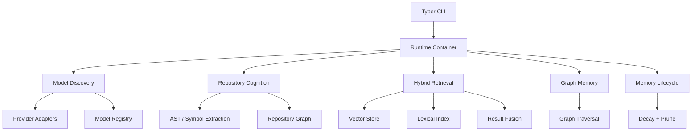

# ---
# title: "Velune Intelligence Foundation"
# description: "Production-oriented cognition layer and subsystem design."
# ---

# Velune Intelligence Foundation

This document describes the production-oriented cognition layer that now sits
under the CLI.

## Subsystem Architecture

- `models.discovery`: local model discovery, classification, and registry
- `repository.cognition`: repository indexing, AST/symbol extraction, and dependency graphs
- `retrieval`: lexical, vector, and hybrid retrieval contracts and local-first defaults
- `memory.graph`: graph memory for entities, tasks, conversations, and relationships
- `memory.lifecycle`: decay, promotion, and pruning policies across memory tiers
- `context`: future context stitching and compression boundary
- `orchestration`: future LangGraph-compatible execution and state contracts

## Dependency Graph

## Repository Cognition Pipeline

1. Scan source files in the workspace.
2. Parse Python with `ast` and other languages with regex-based symbol heuristics, with an explicit tree-sitter adapter boundary for future grammar-backed parsing.
3. Build file, symbol, and import edges.
4. Persist the graph into the repository cognition store.
5. Emit a repository snapshot for future retrieval and orchestration.

## Vector Retrieval Architecture

- Keep the store interface replaceable.
- Use an in-memory local-first implementation by default.
- Support metadata filters and namespaces from day one.
- Fuse lexical and vector signals with weighted ranking.
- Preserve provenance so future rerankers can reason over hit source and score.

## Graph Memory Architecture

- Model all entities and relationships in a directed multi-graph.
- Support traversal by depth for contextual reasoning.
- Keep the store backend replaceable so Graphiti, Neo4j, or Memgraph can be swapped in later.

## Context Lifecycle

- Treat context as a budgeted assembly problem, not a raw concatenation problem.
- Combine relevance, decay, and task focus before building final prompts.
- Prevent token bloat by compressing lower-value memories and prioritizing task-local evidence.

## Implementation Sequencing

1. Model discovery and registry
2. Repository cognition and symbol graphs
3. Local-first retrieval and hybrid fusion
4. Graph memory and traversal
5. Memory lifecycle and decay policies
6. Context assembly/compression
7. LangGraph orchestration boundaries

## Scaling Considerations

- Keep providers, vector stores, and graph stores behind interfaces.
- Use workspace-local defaults before reaching for remote infrastructure.
- Add async boundaries now so orchestration can become concurrent later.
- Keep command handlers thin and route through services in the runtime container.

# Current CLI Surfaces

- `velune models scan`
- `velune models list`
- `velune ask`
- `velune memory stats`
- `velune config show`
- `velune workspace init`
- `velune workspace status`

---
License: MIT
Copyright © 2026 Velune Contributors
